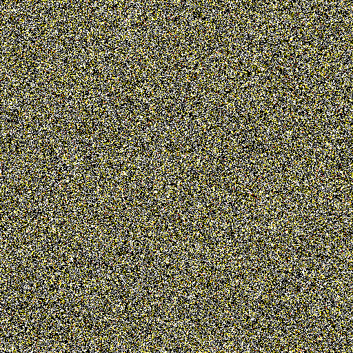
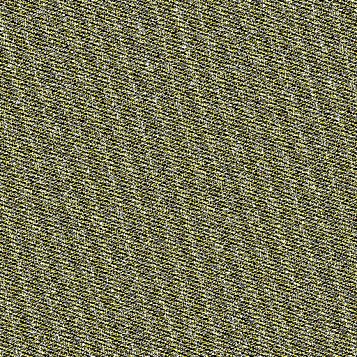

# Hashtable statistics

One of the most common datastructures for quick dictionary lookups are hashtables. One of the most common problems with
them is bad hashfunctions, or data structured just in the wrong way for the chosen hashfunction. You end up with
hashtables with a lot of collisions where there do not need to be some. A hashfunction should ideally behave like random
numbers, and thus from this we can calculate for a given hashtable size and load factor, how much collisions would be
acceptable. 



[You can find detailed information about this module here](HASHTABLE.md)

For now there is basic support for some `std::` and some `boost::instrusive` hashtables, once we get things settles we
might be able to figure out a nice way to add custom support.

## `hashtable`

This command expects a gdb parseable expression that evaluates into some object that is one of the supported hashtables.
It will calculate the statistics of expected collisions (chain lengths) as well as create a nice image that shows for
each bucket in the table how long the chain in there is.

Black pixels are empty buckets, and starting with white, over yellow,orange,red and pink it is ever longer. Ideally for
load factors under 1 you shouldn't see pink pixels. You also should not see any patterns.

For a nice comparison I have here two images, one good and one bad for a hashtable with a load of 0.6


In the linux kernel for a while a lot of DoS attacks had at its heart the ability to manipulate a hashtable into having
long chains, thus massively increasing the lookup time and lowering the ability to handle more data. The following table
is an example output of a hashtable where an attacker managed to get hash values to collide and build up a huge chain.

```
 Chainlen  Bucket%  Num   Ideal   Ideal%
  0        61.12%   3928  2952.4  45.938%
  1        38.85%   2497  2295.9  35.723%
  2        0.02%    1     892.5   13.887%
  2500     0.02%    1     0.0     0.000%
```


