# VDB
A set of python visual enhancements for gdb.

---

**NOTE**
This is work in progress and not yet ready for real world usage, it is more of an experiment of what is possible.
Although I am using it in my daily C++ work, it will likely be unintentionally strict and only work on my setup.

---


<!-- vim-markdown-toc GFM -->

* [VDB](#vdb)
	* [Overview](#overview)
	* [Quickstart](#quickstart)
		* [Installation](#installation)
			* [Manually](#manually)
			* [Python Setup](#python-setup)
	* [Disabling modules](#disabling-modules)
	* [Caveats](#caveats)
* [Modules](#modules)
	* [prompt](#prompt)
		* [Configuration](#configuration)
	* [backtrace](#backtrace)
		* [Commands](#commands)
			* [`bt`](#bt)
			* [`bt/r`](#btr)
			* [`bt/f`](#btf)
			* [`backtrace`](#backtrace-1)
	* [vmmap](#vmmap)
		* [Commands](#commands-1)
			* [`vmmap`](#vmmap-1)
	* [register](#register)
		* [Commands](#commands-2)
			* [`reg`](#reg)
			* [`reg/<showspec>`](#regshowspec)
			* [`reg/s` (short)](#regs-short)
			* [`reg/e` (expanded)](#rege-expanded)
			* [`reg/a` (all)](#rega-all)
			* [`reg/f` (full)](#regf-full)
	* [hexdump](#hexdump)
		* [Commands](#commands-3)
			* [`hd`](#hd)
			* [`hd/p[#]`](#hdp)
			* [`hd annotate`](#hd-annotate)
	* [asm](#asm)
		* [Commands](#commands-4)
			* [`dis`](#dis)
			* [`dis/<context>`](#discontext)
			* [`dis/d`](#disd)
			* [`dis/r`](#disr)
	* [grep](#grep)
	* [pahole](#pahole)
		* [Commands](#commands-5)
			* [`pahole`](#pahole-1)
			* [`pahole/c`](#paholec)
			* [`pahole/e`](#paholee)
	* [ftree](#ftree)
		* [Commands](#commands-6)
			* [`ftree`](#ftree-1)
		* [Special Filter Functionality](#special-filter-functionality)
			* [Downcasting to hidden types](#downcasting-to-hidden-types)
			* [Pretty print filters](#pretty-print-filters)
			* [Expansion blacklists](#expansion-blacklists)
			* [dynamic array/vector type detection](#dynamic-arrayvector-type-detection)
	* [Dashboards](#dashboards)
		* [Ports](#ports)
		* [TTYs](#ttys)
		* [tmux panes](#tmux-panes)
		* [Other commands](#other-commands)
		* [Configuration](#configuration-1)
	* [Hashtable statistics](#hashtable-statistics)
		* [`hashtable`](#hashtable)
	* [ssh](#ssh)
		* [`attach` to process](#attach-to-process)
		* [`run` a process](#run-a-process)
		* [debug `core` file](#debug-core-file)
		* [Remote csum cache](#remote-csum-cache)
		* [configuration](#configuration-2)
	* [track](#track)
		* [`track show`](#track-show)
		* [`track <num|location> <expression>`](#track-numlocation-expression)
		* [`track data`](#track-data)
		* [`track del`](#track-del)
		* [`track clear`](#track-clear)
* [global functionality](#global-functionality)
	* [shorten](#shorten)
	* [pointer (chaining)](#pointer-chaining)
	* [memory layout](#memory-layout)
	* [type layout](#type-layout)
* [Configuration](#configuration-3)
	* [gdb config](#gdb-config)
	* [Color settings](#color-settings)
		* [colorspec](#colorspec)
* [Plugins](#plugins)
* [Themes](#themes)
* [Troubleshooting](#troubleshooting)
	* [Python encoding errors](#python-encoding-errors)
* [TODO](#todo)

<!-- vim-markdown-toc -->

## Overview
vdb aims to display as much information as it can without cluttering the
display. It can filter and colorize output, and when the terminal isn't enough
anymore it creates dot graphs and images.

It tries to be as minimally invasive as possible, allowing to disable certain
modules and commands to not interfere with other python plugins.

## Quickstart
First clone the repo
```
git clone https://github.com/PlasmaHH/vdb.git
```
### Installation
#### Manually
Install dependencies from the `requirements.txt` or install as a package.
Then add this to your `~/.gdbinit`
```
source ~/git/vdb/vdb.py
vdb start
```
#### Python Setup
Using python setuptools one can simply run
```
sudo python ./setup.py install
```
and then edit `~/.gdbinit`
```
source /usr/bin/vdb.py
vdb start
```

---
In case a dependency is not available, the module needing it will not load, but all others should. In practice this
means screens full of error messages and a limited feature set, but for a lot of modules plain pyhton is enough. The
most notable exception though is the ansicolor module which of course  is necessary since basically all features are
about colours.
## Disabling modules
There is one boolean gdb option per module. Setting those to off before `vdb
start` will prevent the corresponding module from being loaded. Once loaded a
module cannot be unloaded.
```
vdb-enable-prompt
vdb-enable-backtrace
vdb-enable-register
vdb-enable-vmmap
vdb-enable-hexdump
vdb-enable-asm
```
Additionally there is the gdb config 
```
vdb-available-modules
```
available which will not only allow for a more concise way to disable modules, it will also control the order in which
they are loaded. Must be set before a vdb start and contains a comma separated list.

The drawback however is that you will miss out new modules when updating, as they are not in the list.

## Caveats

Due to the somewhat incomplete nature of gdb events and scripting API we are forced to use gdb script command hooks for
some of our functionality. Since they do not chain on their own, it might be that it interferes with other plugins, so
either their hooks or our hooks do not work. This is especially true for the track module.

# Modules
## prompt
This module allows you to configure the prompt to display more information.

For now this only sets the prompt to `vdb> ` in a certain colour. In the future we will add more information about the
currently running program or core file, maybe we can hack together a good multiline or airline prompt.

XXX Maybe as a first one the thread that is selected, as for breakpoints or other things this changes unintuitively.
Maybe also add a feature to autoselect a thread or a frame (given by some complex path?)
### Configuration

* `vdb-prompt-colors-text` The colour of the whole standard prompt
* `vdb-prompt-text` The text of the prompt, defaults to `vdb> `

## backtrace
We provide a backtrace decorator with various colouring options. It will also show some information about whether something
is inlined or some information about signals and crashes.

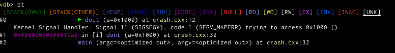

* `vdb-bt-colors-namespace` Colour all namespace names (for the purpose of this plugin, this includes class type names)
* `vdb-bt-colors-address` Addresses in the address column. Set this to none to use the global pointer colours by memory area type.
* `vdb-bt-colors-function` Function name (without any namespace and template parameters)
* `vdb-bt-colors-selected-frame-marker` The marker that shows which frame gdb has currently selected
* `vdb-bt-colors-filename` The filename (and line number) of the source code for this frame
* `vdb-bt-colors-object-file` The object file, in case the file and line numbers are unavailable
* `vdb-bt-colors-default-object` In case the two above could not be determined, show whatever gdb would have shown per
  default (usually the object name)
* `vdb-bt-colors-rtti-warning` Sometimes gdb can't properly access the RTTI information. While we try to be as good as
  possible in recovering it, gdb outputs warnings. They are usually suppressed and just a small string displayed in this
  colour.

Addresses (in the address column) is some special beast. Since the gdb decoration mechanism only allows us to return
integers/pointers, we are forced to hack around this by putting the strings elsewhere. There are situations  where this
can look funny. You can use the following setting to disable the colouring then. 
```
vdb-bt-color-addresses=true
```
Per default the colour is chosen by the
pointer color according to the colorspec (See section colorspec) below.
```
vdb-bt-address-colorspec="ma"
```
The showspec setting
```
vdb-bt-showspec="naFPs"
```


tells what should be displayed in the backtrace. Missing items are suppressed. The string can contain (in any order)
* `n` The frame number.
* `a` The address, coloured according to the above settings
* `f` or `F` the function name. For `F` we use the full name (minuse folds and shortens), for `f` we display just the
  name without any parameters or templates.
* `p` or `P` shows the parameters of the function. For `p` we only show the names, for `P` we also try to get gdb to
  print some values for them
* `s` shows the source of that frame. Can be a source file (with line) or some object file name.

You can also change the marker for the selected frame, this may be useful if your terminal does not support the default utf8 character.
```
vdb-bt-selected-frame-marker
```
### Commands
We provide the following commands
#### `bt`
This should be your default. It will do all the filtering and sometimes write some additional data.
#### `bt/r`
This is like `bt` but disables the filter aka. raw. You should not see additional data, but the unfiltered plain gdb output.
#### `bt/f`
This is like `bt` but also passes the `full` parameter to backtrace to show all local variables per stackframe. These are not currently filtered.
#### `backtrace`
This is an unmodified gdb version, that is running the decorator, but not additional filters and outputs. It may be overridden by additional gdb plugins that you have. This has the added disadvantage that the `n` showspec doesn't have any effect, as well as the RTTI warning filter not working.

## vmmap
A module that allows access to the internal information of memory maps. It ties together information from the sources of
* `info files`
* `maint info sections`
* `info proc mapping`
### Commands
#### `vmmap`
Without parameters it shows a list of memory ranges and colours their addresses according to the memory types. The ranges can overlap. Additionally it shows section names and source files.

Different components of gdb provide different section names, if there is an alternative name it will be shown in []. Also the file information can differ, as some show the file name that was used to load, others dereference all symlinks.

As one of the parameters it accepts a colorspec, the other is an address. If the address lies within overlapping sections it will show the smallest matching section.
## register

### Commands

#### `reg`
This command is like `info register` just with a bit more information and options. It can display the most basic
registers or an existed version of all registers. Just a hex value overview, or a detailed dereference chain. It
colours the pointer according to where they point to (see the legend of the command). It tries to detect when a pointer
value is invalid, but contains an ascii string instead (hints to it being read from re-used memory). It has the
following variants (and defaults to what is configured in `vdb-register-default`, which itself defaults to `/e`):

#### `reg/<showspec>`
When the parameter isn't one of the special variants below, it will be interpreted as a showspec. Lower case letters
denote the standard (usually smaller) version, whereas uppercase letters denote the expanded version with more details.
Sometimes there is no difference, but to always provide an uppercase version we accept that too, and maybe in the future
we might add information at that point. `.` is always ignored, in which way you can work around ambiguities with the
below shortcuts.

If you want to show the integer value alongside the hex value of each register set `vdb-register-int-as-int` to true.

* `iI` show all the integer and general purpose registers, just like `info reg` does.
    

* `vV` show all the vector registers and try to make sense of them, tries to take the biggest version of registers that
  are overlaid. The mxcsr flags are shown too.

    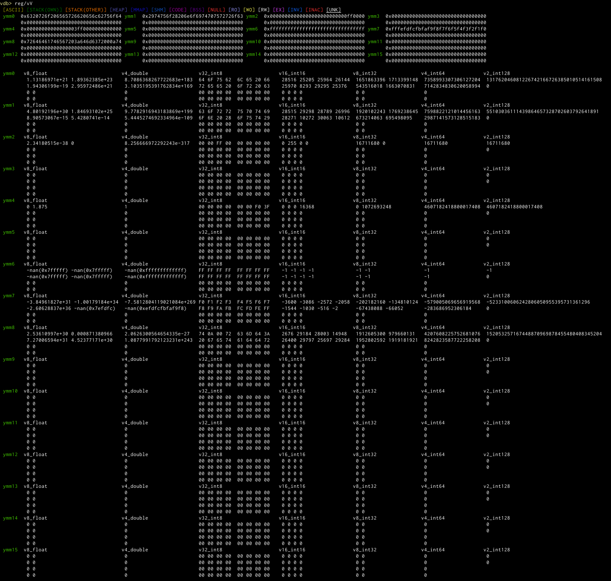
* `fF` show all the float registers and flags.

    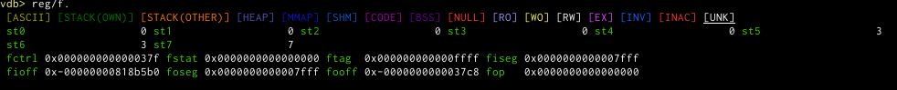

    (Note how you have to use `f.` to distinguish it from the "full" shortcut.
* `xX` shows the integer register [e]flags

    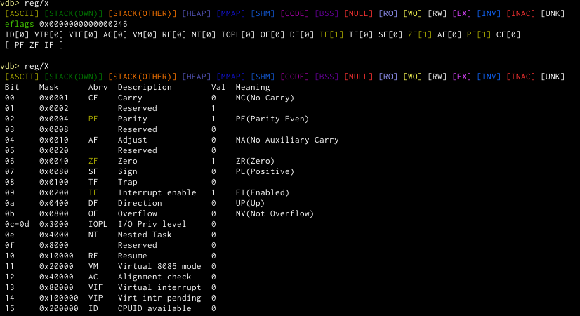
* `pP` Shows the prefix/segment registers.

    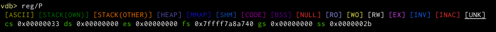
* `mM` shows the SSE MXCSR register.

    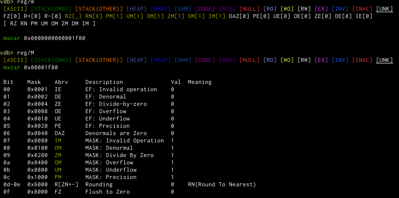

#### `reg/s` (short)
Same as `reg/ipx`.

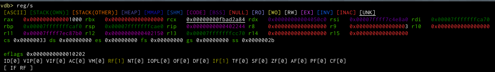
#### `reg/e` (expanded)
Same as `reg/Ipx`.

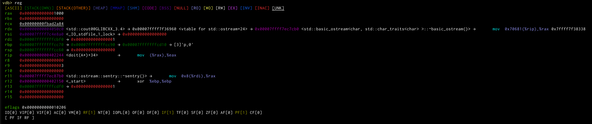
#### `reg/a` (all)
Same as `reg/ixfpmv`.

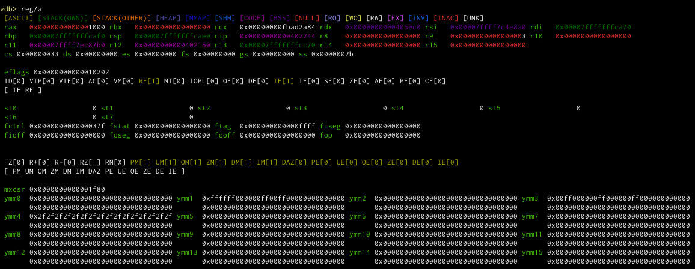
#### `reg/f` (full)
Same as `reg/IXFPMV`.
(not yet implemented)

## hexdump
This module provides a coloured hexdump of raw memory, possibly annotated in various ways.

### Commands

#### `hd`
This command dumps the range of memory specified by the parameter. If you omit the second size parameter, it will be set
to the value of `vdb-hexdump-default-len`. It will try to dump that many bytes, if along the way it reaches a point
where memory will not be accessible anymore, it stops.

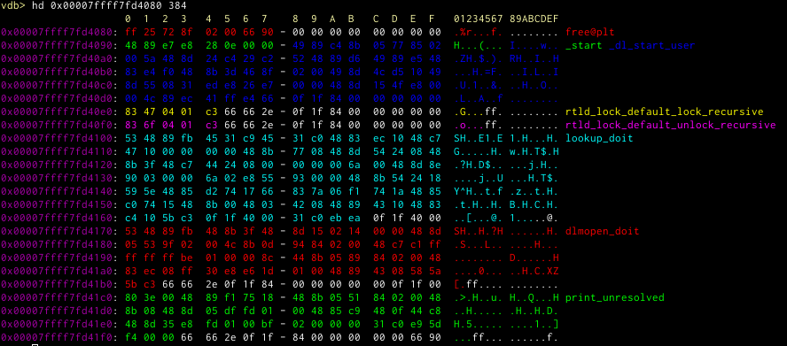

If it knows the memory belongs to some symbol, it will colour it in a specific colour and annotate the symbol at the
side. You can control the color with the semicolon separated list of colours in the `vdb-hexdump-colors-symbols` setting.

The setting
```
vdb-hexdump-colors-header
```
controls the colour of the header (the one that should make it a bit simpler to find certain bytes). 
#### `hd/p[#]`

This version of the hexdump command tries to apply the same pointer dereferencing chain logic that is used to display
registers for a hexdump. It is assumed that the whole displayed hexdump is an array of (aligned) pointers and then it is
tried to interpret them. If they do not look in any way like a pointer however no additional output is generated. This
is added to the standard annotation of symbols. This is added to the standard annotation of symbols. An optional number
after this is interpreted as the maximum chain length for the pointer chains. It can also be set via the config option
`vdb-hexdump-default-chaindepth`. Furthermore the single chains are separated by `vdb-hexdump-pointer-chain-separator`.

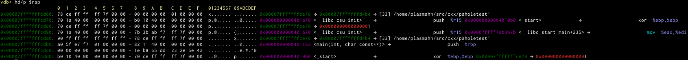

#### `hd annotate`
```
Usage: hexdump annotate <addr> <len> <text> or <addr> <typename>
```
This command will add annotation to a specific range of memory. The first version adds a free manual text to a specific
address and length. It will always be displayed as long as some of those bytes are being displayed in any hexdump.
r
The second version takes an address and a typename. It will then extract the same information as `pahole` does and then
colour that specific memory always with these annotations. If then you use hexdump to dump a variable without a
specified size, it will be able to automatically take that size and dumps only that object.

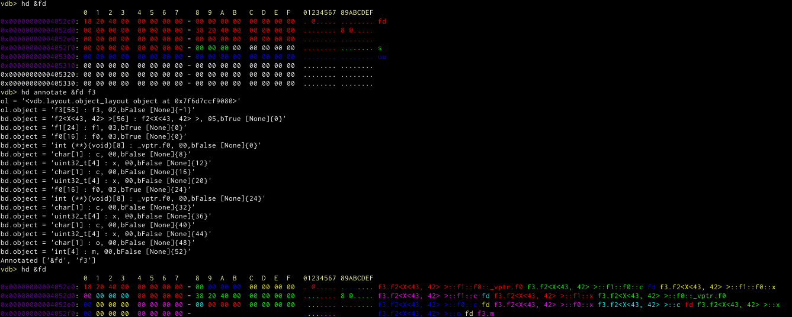

(The debug output will likely vanish in a future version)

Note how in the places where there is a hole in the object only 'fd' is being displayed.

## asm
This is a disassembler module

### Commands

#### `dis`
This is a "plain" disassembly. It expects a gdb expression as a parameter that would be accepted by gdbs `disassemble`
command.

The displayed data can be controlled by the following showspec setting

```
vdb-asm-showspec
```

The order is fixed and the showspec entries mean the following:

* `m` Shows a marker (configured by `vdb-asm-next-marker`) for the next-to-be-executed instruction
* `a` Shows the address
* `o` Shows the offset
* `d` Shows a tree view of the known jumps in the current listing. They are coloured in a round robin fashion. It tries
  to detected computed jumps but isn't very good in it.
* `b` Shows the instruction bytes
* `n` Shows the mnemonic (along with its prefix).
* `p` Shows the parameters to the mnemonic
* `r` Shows a reference, this is mostly arbitrary text that the disassembler gave us (or text that we failed to parse properly)
* `t` or `T` Shows for jump and call targets the target name, run through the standard shorten and colour mechanism
* `j` shows a reconstructed possible history for the origin of the flow path
* `h` or `H` shows a listing of the history of executed instructions when instruction recording was enabled.


The following settings control the colours
```
vdb-asm-colors-namespace
vdb-asm-colors-function
vdb-asm-colors-bytes
vdb-asm-colors-next-marker
vdb-asm-colors-addr
vdb-asm-colors-offset
vdb-asm-colors-bytes
vdb-asm-colors-prefix
vdb-asm-colors-mnemonic
vdb-asm-colors-args
```

Additionally `vdb-asm-colors-jumps` is a semicolon separated list of colours to use for the jump tree view.

If you set the addr colour to `None` (default) it will use the standard pointer colouring. If you set the mnemonic
colouring to `None` (default) it will use a list of regexes to check for which colour to chose for which mnemonic. Same
for the prefix.

You have a little more control over the way offset is formatted by using the setting `vdb-asm-offset-format` which
defaults to `<+{offset:<{maxlen}}>:` where `offset` is the offset value and `maxlen` is the maximum width of an integer
encountered while parsing the current listing.


In case your tree view is very wide, you might
like setting the option `vdb-asm-tree-prefer-right` to make the arrows prefer being more on the right side.


Sometimes the display gets a little bit complex:
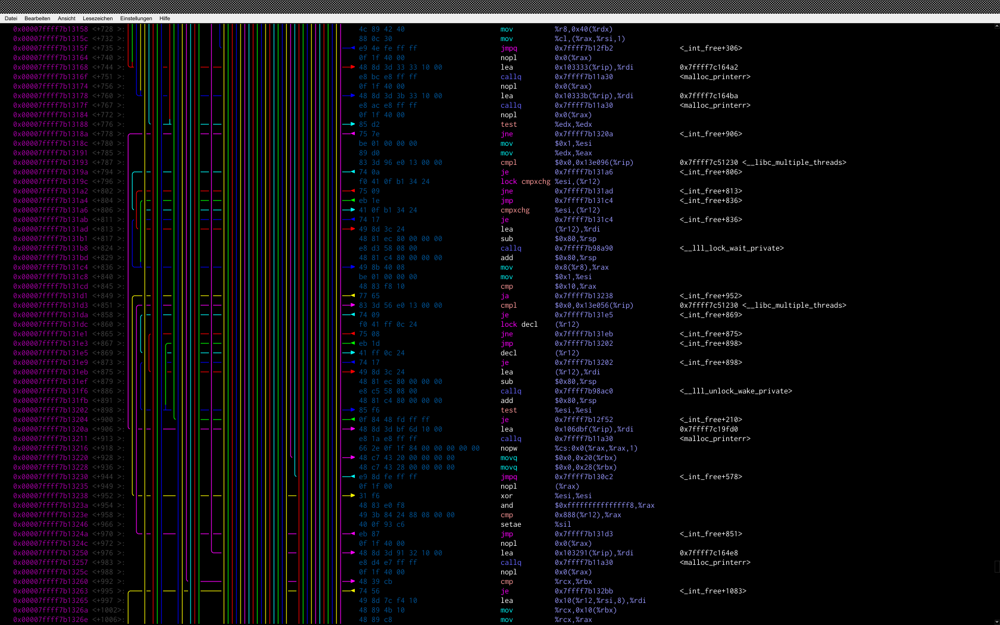

There isn't too much you can do, but adding more colours sometimes helps to distinguish the arrows better.

#### `dis/<context>`
This limits the displayed disassembly to the context of the passed amount of lines around the `$rip` marker. Should
there be no such marker, this has no special effect. Note that the whole disassembly will be generated, filtered, and
rendered (at least partially), just the output of the other lines suppressed, so if you want this for speedup, this
isn't for you. The benefit however is that the jump tree view will be completely fine.

#### `dis/d`
Outputs the disassembler just like the plain format, additionally creates a `dis.dot` file that will contain a dotty
representation of what we think might be basic blocks and (conditional) jump instructions. It will also try to start
dot with the command specified in `vdb-asm-`

The following example is the same as the disassembler listing above. It doesn't use the `r` and `t` showspecs for
brevity.

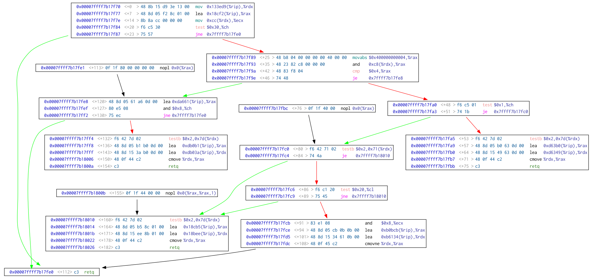

The whole settings for colours of the terminal listing exist too for the dot ones, just append `-dot` to the setting
name. The showspecs are the same with the exception of the tree view. The layout of graphviz can sometimes be a mess,
therefore we offer the following ways to influence things in the graph (besides colour):

* `vdb-asm-prefer-linear-dot` configures that the layout should give priority to the order of instructions when laying
  out the graph (makes dot edges unconstrained for non consecutive instructions). Can get a bit messy when there are
  unconditional jumps.
* `vdb-asm-font-dot` is a comma separated list of fonts. It is embedded int the `.dot` file and the exact format depends
  on how your graphviz is compiled, on the majority of the system it should be the names you can get via `fc-list`.
#### `dis/r`

This calls the gdb disassembler without any formatting
## grep
When loading this module, all our commands support a pipe like syntax to call grep on the output. The data will be piped
to an externally called grep, as well as the parameters to grep.

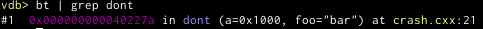

## pahole
This is an enhanced and redone version of the pahole python command that once came with gdb. It has support for virtual
inheritance and a possibly more useful layout display. Bitfield support is missing for now as well as proper support for
unions. Type names are shortened via the standard mechanism where possible.
### Commands

#### `pahole`
This expects a type and can have one of two flavours, see below. Setting `vdb-pahole-default-condensed` will change the
default, but you can always override with `/c` or `/e`

The following examples are for the following code:
<table>
<tr>
<td>

```c++
struct f0 {
	char c;
	uint32_t x;
	virtual ~f0(){}
};

struct f1 : f0 {
	char c;
	uint32_t x;
	virtual ~f1(){}
};

struct f2 : f1,f0 {
	char c;
	uint32_t x;
	virtual ~f2(){}
	char o;
};
```
</td>
<td>

```c++
struct innerst {
	int i;
	double po;
};

struct small {
	char c = 'C';
	uint16_t x = 0x8787;
	char h = 'H';
};

struct big {
	uint64_t n = 0x7272727272727272;
};

struct morev : virtual small, virtual big, virtual innerst {
	uint64_t y = 0x4b4b4b4b4b4b4b4b;
	uint16_t p = 0x1515;
	char u = 'U';
};

```
</td>
</tr>
</table>


#### `pahole/c`
This shows the types layout in a condensed format, one line per member, showing which bytes belong to it in the front

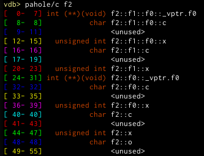
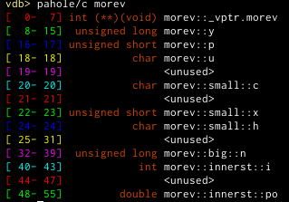

#### `pahole/e`
This shows the layout in an extended format, one line per byte.

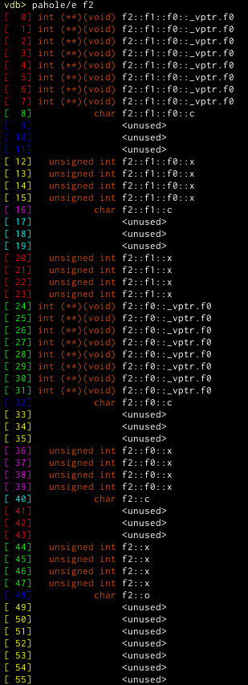
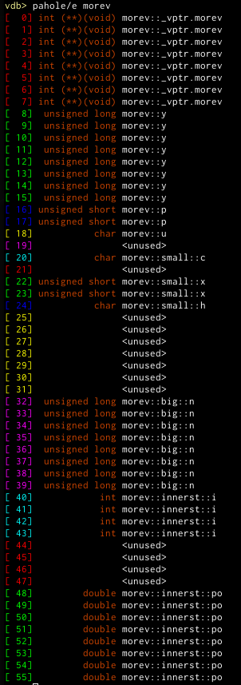


## ftree
The ftree module allows for creation of dotty files that create a tree (or directed graph) out of a datastructure.

For example, the following structure filled with life 

```c++
struct xtree
{
	std::string str{"HELLO WORLD"};
	std::string& xstr = str;
	std::unordered_map<int,int> u;
	std::vector<int> v { 1,2,3,4,5,6,7,8 };
	std::vector<std::string> sv { "1","2","3","4","5","6" };
	std::array<double,13> a;
	std::map<int,int> m;
	std::map<int,int> bl;
	std::list<std::string> l { "A","B","L" };
	void* ptr = &m;
	void* ptrptr = &ptr;
	nunion NU;
	nunion nu[2];
};
```

could be displayed as

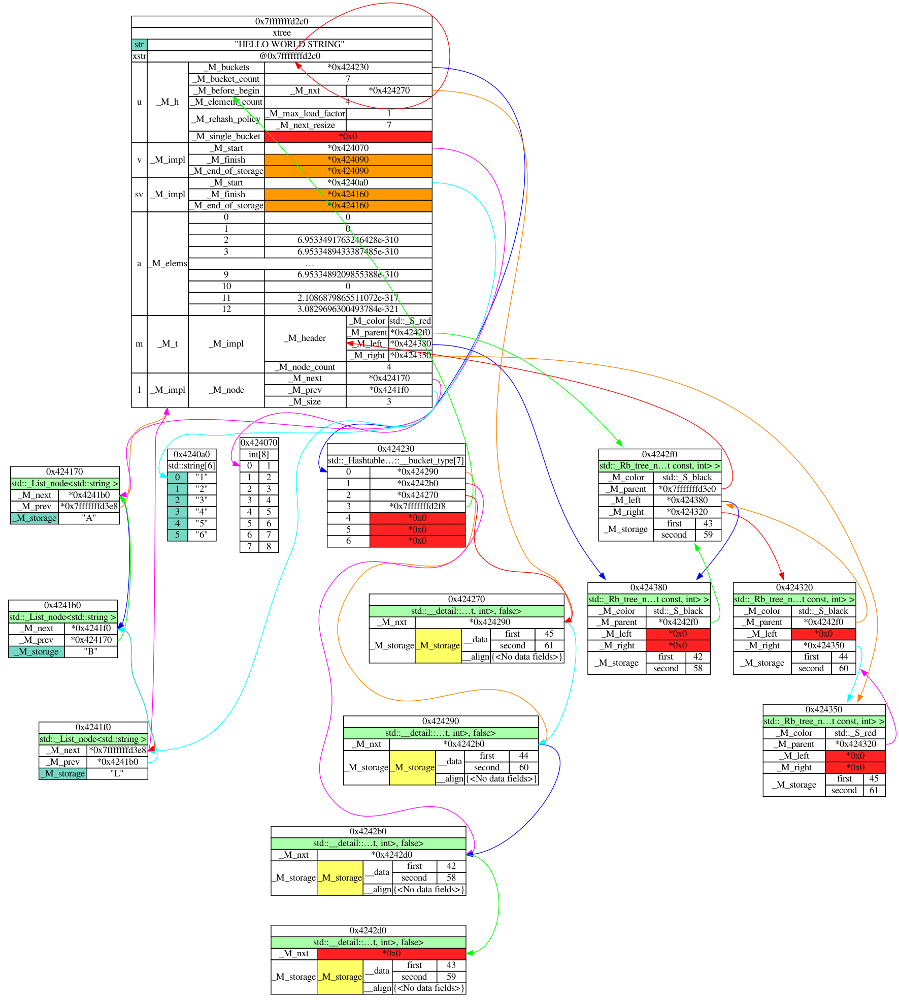


### Commands

#### `ftree`
The ftree command expects a pointer to an object. It will create a dot file based on the filename configured in
`vdb-ftree-filebase`. The string there will be fed through strftime and then `.dot` will be appended to it. The default
is `ftree` so it will always overwrite the last one. Using `ftree.%s` will be the most trivial way to create a file for
each invocation. The default depth limit for the tree is at 70, you can specify another limit as the second parameter.

After the dot file is created, the generated filename will be fed to the string format in `vdb-ftree-dot-command` and
the created command will be executed, usually to display the generated file directly.

Pointers will be displayed with their value, and a dot edge drawn to the object it points to. Cells will be colored
according to the following settings:

* `vdb-ftree-colors-invalid` When the memory is inaccessible, the background of that table cell will be this color. Various other kinds of exceptions generated during the creation of the target node can unfortunately also lead to that
colour.
* `vdb-ftree-colors-union` When this field is a union, it will have this colour. This means that all the direct
  subfields share the same memory.
* `vdb-ftree-colors-virtual-cast` is the color of a node when the pointer was pointing to a base class but we determined
  it really is a derived object.
* `vdb-ftree-colors-down-cast` When the downcast filter mechanism decided to change the nodes type, it will be colored
  in this color. Depending on the actual circumstances this and the virtual cast color can compete with each other and
  only one wins.

Additionally the following settings influence the generated graph:

* `vdb-ftree-shorten-head` When the type string in the nodes header is too long, it will be shortened and this amount of characters will be taken from the type names head
* `vdb-ftree-shorten-tail` Same as head, but for tail
* `vdb-ftree-verbosity` Setting this to  4 or 5 will create some debug output about the type matching for the cast and array filters. Usually you want to set this to fine tune the regex.

### Special Filter Functionality

Via the plugin mechanism you can put into the `.vdb/ftree/` dir a python file that imports the ftree module and calls
some functions for the following functionalities. For examples it is best to look at the existing source code. There is
always one add and one set function. The add function adds one to the existing list, the other sets the whole list. This
is useful when you don't want to use the built in functionality.

#### Downcasting to hidden types
When there is a pointer of a base class type, we try to get the dynamic type via RTTI from gdb. If the type has integers
as template parameters (or some other corner cases) gdb will sometimes fail to find the type information (because the
internal string representation does not match up) and then we try to work around that. 

Sometimes there is a pointer pointing to base classes of a non-virtual type, thus we don't have any RTTI. In that case
we have a mechanism that gets a type path (that is all the types and members involved that lead to it), applies a regex
to it, and then transforms it into a new type string and then cast it to that. See the examples for some `std::`
containers that have nodes. They are accessed through a base class and then `static_cast`ed to the right type, thus we
have to do the same.

Functions to call

* `{add,set}_node_downcast_filter` add a regex and a callable object. When the type matches, the callable will be called
  with the regex match object, gdb.Value and object path. The result is either None or a gdb.Type that the node pointer
  will be caste to before a new node will be extracted from it.
* `{add,set}_member_cast_filter` This is basically the same, but for members of a node. The resulting type therefore is
  not a pointer type.

#### Pretty print filters

For certain types we may want to use the gdb pretty printer to obtain the output rather than to extract all the members.
This is mostly useful for things like `std::string` where we usually don't care about the internals and just about the
value.

* `{add,set}_pretty_print_types` adds a regex that will match a type that will then always be pretty printed. Note that
  when the type exists as a typedef, sometimes you need to match the typedef name.

#### Expansion blacklists
Sometimes you are not interested in certain members at all or don't want the system to follow certain pointers. With
this mechanism you can blacklist those. Table cells will be coloured according to the
`vdb-ftree-colors-blacklist-pointer` and `vdb-ftree-colors-blacklist-member` settings.

* `{add,set}_pointer_blacklist` expects an object path blacklist that will prevent a pointer from being followed to the
next node.
* `{add,set}_member_blacklist` Does not expand the member with the name, but still prints the name.


#### dynamic array/vector type detection
For types like `std::vector` there is usually internally a pointer to the object being stored, but the type system has
no idea that it is pointing to an array, not a single object. Similar to the hidden type thing we have a regex mechanism
that can be used to access other members that then can be used to determine the amount of elements.

The setting `vdb-ftree-array-elements` is a comma separated list of python like element indices, that is when they are
negative they are counted from the back of the array. Since arrays can be very long, this limits the amount of things
displayed. Per default its the first and last four items.


* `{add,set}_array_element_filter` adds a regex and a callable, the callable should return the amount of elements in the
  array. Optionally the callable can be replaced by a string that will then be fed to a format with the regex match as a
  parameter. This will then be the object path to the amount of elements.


## Dashboards

Dashboards are a way to configure some output to be done on certain events to specific locations that display them
outside of the terminal gdb is running on. This is usually a terminal running in some other way. To be most flexible we
can output to ports (allowing you to also have the output in terminals on other hosts), ttys (and any file really) or
specific ttys on tmux panes.

Without any special trigger, the command will be executed always before a prompt is being displayed. When registering
the command via the API you can also call arbitrary python functions and display their return instead.

### Ports
`dashboard port <port> <command>`
or
`dashboard port <host>:<port> <command>`

will open a listen port and anyone connecting to it will get the output for that. If not specified the host will be
0.0.0.0 or :: depending on whatever python thinks. Anything that tries to format the output for a specific terminal
width will have no luck getting the width and thus do whatever it thinks is best.


### TTYs
`dashboard tty /dev/ptyXX <command>`

outputs to the specified tty, you can leave out the `/dev/` part if you want to. This is basically the same as the tmux
target, just that instead of a named tmux pane you chose the tty yourself. If unsure which tty a terminal you have open
is, just execute `tty` on that terminal.
### tmux panes
`dashboard tmux <pane-name> <command>`

The pane-name is a regex that will be applied to all tmux panes, and the first match is then taken, given it provides a
tty.
<!--
For extra convenience we have a tmux command that will directly forward all parameters to a tmux call, thus you can do a
`tmux list-panes` yourself easily to find a proper pane. We recommend though to have your (project specific) plugin
directories contain the settings to setup a dashboard. We provide some examples in the example `.vdb` directory that
will enable you to 
-->
### Other commands

* `dashboard show` Shows a list of all dashboards. The meaning of the columns is as follows:
    * __EN__ Y/N for being enable or not. 
    * __CLS__ Y/N for clearing the screen before outputting anything. The default. Disable this if you want to send two
      dashboards to one output.
    * __ID__ The numerical ID by which this entry is identified in any of the commands that need one.
    * __Type__ the type this was created as (tmux/tty/port)
    * __Target__ the type specific description of the target
    * __Event__ the (gdb) event on which this dashboards output is triggered. before_prompt is the default.
    * __Command__ the gdb command to execute. Its complete output will be redirected, no paging available.

* `dashboard enable/disable` Disables a dashboard. It will still be in the list, but not executed upon events. This may
  mean that something like an open port is still there.
* `dashboard delete` Completely remove the dashbaord, destroying all associated objects, usually closing listening ports
  etc.
* `dashboard [no]cls` Enables or disables the option to clear screen before starting the output. Clearing the screen is
  done via ansi escape sequences.

### Configuration
The boolean config option
```
vdb-dash-show-stats
```
will make all dashboard outputs be preceded by some internal statistics. For now they are the time it took in the
command to generate the output and the amount of output bytes. Later more might follow.

## Hashtable statistics

One of the most common datastructures for quick dictionary lookups are hashtables. One of the most common problems with
them is bad hashfunctions, or data structured just in the wrong way for the chosen hashfunction. You end up with
hashtables with a lot of collisions where there do not need to be some. A hashfunction should ideally behave like random
numbers, and thus from this we can calculate for a given hashtable size and load factor, how much collisions would be
acceptable. 

For now there is basic support for some `std::` and some `boost::instrusive` hashtables, once we get things settles we
might be able to figure out a nice way to add custom support.

### `hashtable`

This command expects a gdb parseable expression that evaluates into some object that is one of the supported hashtables.
It will calculate the statistics of expected collisions (chain lengths) as well as create a nice image that shows for
each bucket in the table how long the chain in there is.

Black pixels are empty buckets, and starting with white, over yellow,orange,red and pink it is ever longer. Ideally for
load factors under 1 you shouldn't see pink pixels. You also should not see any patterns.

For a nice comparison I have here two images, one good and one bad for a hashtable with a load of 0.6

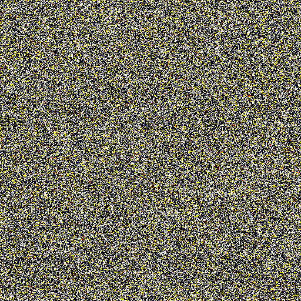


In the linux kernel for a while a lot of DoS attacks had at its heart the ability to manipulate a hashtable into having
long chains, thus massively increasing the lookup time and lowering the ability to handle more data. The following table
is an example output of a hashtable where an attacker managed to get hash values to collide and build up a huge chain.

```
 Chainlen  Bucket%  Num   Ideal   Ideal%
  0        61.12%   3928  2952.4  45.938%
  1        38.85%   2497  2295.9  35.723%
  2        0.02%    1     892.5   13.887%
  2500     0.02%    1     0.0     0.000%
```

## ssh
We provide some "remote debugging" features that are based around logging into another host via ssh and debugging
something there (a live process or some core file). 

Note: currently only non-interactive authentication is supported since we intercept all terminal i/o of ssh.

### `attach` to process

While in classical gdb/gdbserver you have to setup a communication path yourself, the attach mechanism will try to take
care of all of that, so you have to do only the following command:

```
ssh <hostname> attach <pid-or-name>
```

which will login to the given host, try to figure out what pid the name is referring to (see configuration for options
to control that), copy over the binary (shared objects can be accessed through gdbserver, the executable not) and attach
to the process via gdbserver. So the only thing that has to be available on the other host is a somewhat recent
gdbserver.

When the prompt module is active, this will also change the prompt to make it clear that you are attached to a remote
process.

### `run` a process

Similarly to the attach, using run will try to run the given command as if it was on the command line. Be aware that
since it starts the process in the gdbserver in a very early state before main, a lot of shared objects may not be
resolved, thus you might need to issue a `vmmap refresh`.

### debug `core` file

For cases where on the remote system there is a core file, the `core` subcommand is useful. You don't need anything on
the remote host, as everything is copied locally (gdbserver can't read corefiles anyways). For example the command

```
ssh <hostname> core core.ftree_30563_1556640000_6_1001_101
```

Will initiate a complex chain of events that will try to find the core files generating binary, then the shared objects
that are loaded, copies it all over and instructs gdb to only ever use these shared objects instead of local ones. The
files are cached so that for a future invocation you will not have to do the copying again. Since we don't know when you
are done, you have to clean them up yourself. You also have some control over these files

Additionally we try to find and copy debug files and shared objects that have been loaded via `dlopen()`. The mechanism
isn't perfect, but you can always manually copy the debug files into the lib directory, just name them the same as the
`.so` file but add `.debug` to the filename.

In case the binary that has created the corefile was overwritten you can give the name of a binary as a parameter after
the core file name to override automatic detection of which file created the core file.

### Remote csum cache
Instead of calculating the checksum for a remote file, the copy functionality can also take the checksum from a cache.
The only way to add to the cache is via the command `ssh csum <host>:<file> <csum>` which will be mostly useful for when
the core and/or binary file has already been copied over but is so huge that even calculating the checksum takes too
long to be useful. Usually this is then put into a project specific configuration file.

### configuration

For the attach command you can change the way it tries to get the pid of the process name you supply. The most versatile
tool here is pgrep, but in case its not available you should probably configure `/sbin/pidof` (yeah, full path, a lot of
systems don't have `/sbin` in their `PATH`). The `%s` in it will be replaced by the parameter you pass to the command.

```
vdb-ssh-pid-cmd
```

All copying commands do checksumming  on the remote to see if they have to copy it over. This tells which command to
use. Since all commands have timeouts on the ssh connection, and checksumming can sometimes take a long time on slow
systems which huge core files, we offer a way to give a float in seconds of the timeout for that specific checksum
command.
```
vdb-ssh-checksum-command
vdb-ssh-checksum-timeout
```

You can tell scp to use compression (be careful, when you use ssh master sockets this is overridden by the first opened
ssh connection), though it only helps if you debug over the internet. The temporary files used in the cache will be
stored under the given name, you can change it if you e.g. want to store them all at one place to have it easier to wipe
them all. You always have to put `{tag}` and `{csum}` in there, otherwise you will have files overwriting each other.

```
vdb-ssh-scp-compression
vdb-ssh-tempfile-name
```

Since this plugin will open an ssh tunnel for the gdb tcp connection to go over, we have to chose a port. We check if
its available on the remote as well as the local system. This allows you to chose the range we can chose from. You can
set it to a single port too.

```
vdb-ssh-valid-ports
```

In some circumstances we want to make you aware of that we are on a remote system all the time, so when the prompt
module is active, we change the prompt. These options let you customize the prompt for this.

```
vdb-ssh-colors-prompt
vdb-ssh-prompt-text
```
## track

The `track` command allows you to track the data of gdb expressions on hitting breakpoints. While this module is active,
whenever a breakpoint is hit an internal callback will be called, this may be a performance issue for some. All
breakpoints that have a trackpoint attached will automatically continue when hit, making data collection an automated
task.

### `track show`

Shows the currently known breakpoints (similar to `info break`) along with the information about registered tracking
information.

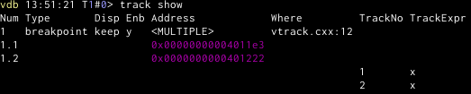

### `track <num|location> <expression>`
This will  use gdbs existing breakpoint no `num` and will execute `expression` each time, recording the resulting string
along with a timestamp.

Instead of giving a number in `num` you can also provide an expression that will then be given to gdb to create a new
breakpoint. This breakpoint however will remain active even after the trackpoint has been deleted. Be careful though
that you may end up with multiple breakpoints for the same address which may incur a performance hit. We try to filter
out by the location string you passed, but what gdb gives us may not always be the same you passed, thus we can not
distinguish.

### `track data`
This shows a table with all the collected data. In (default) relative mode, all timestamps are relative to the first
recording. You can set `vdb-track-time-relative` to disable this and use local timestamps instead (useful for long
running programs where the breakpoint is only hit occasionally). Note that this will display the string from the
expression per table entry without any further formatting, as such it is most wise to use expressions only that have
small outputs.

Setting `vdb-track-clear-at-start` to off will disable the automated clearing of tracking data when (re)starting a
process.

If at a specific breakpoint an expression did not yield any output (or caused an exception) this field will remain
empty.

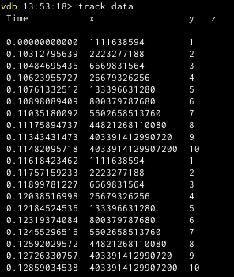
### `track del`
This deletes a track entry by the number shown in `track show`, just like `del` does for breakpoints. You can specify
multiple trackpoints.


### `track clear`
Clears the data cache displayed by `track data`.

# global functionality
There is some functionality used by multiple modules. Whenever possible we load this lazily so it doesn't get used when
you suppress loading of the modules that load it.
## shorten
There is a configurable way to shorten type names. We will have
* replacements, which plainly replace one string by another. (For now this is string replace only, maybe we should use
  regexes here)
* template folding. We have a list of types (or maybe we should use regexes here too?) that we mark and then we fold the
  complete list of template parameters into one empty list (and colour that).

## pointer (chaining)
The submodule for pointer colouring supports chaining them as well, which will lead to a string of dereferenced pointers
until a determined length is reached or something useful is found. You can find examples in the register commands. It
uses internally the memory layout module

## memory layout
Provides information about the memory layout gathered from various sources. Primary source of information for the vmmap
command as well as the pointer colouring.

## type layout
This is the submodule that is responsible for parsing gdb type information and reconstructing an in-memory layout. This
is mainly used by the pahole command.

# Configuration
The configurability is using two mechanisms. One is the gdb settings. Besides
the module loading settings, all settings are only available after a `vdb
start`.
## gdb config
Setting any string based configuration option to the special value `default` will reset it to the built in default. You
can set them in the .gdbinit file after the `vdb start` command, or you can provide a `~/.vdbinit` file that will be
sourced into gdb when it exists. When the setting <whatever we chose for it> is enabled, we will also read the
./.vdbinit after it, which can be project specific. If that doesn't exist we go down the filesystem until we either find
one, or we reach ~/ (which we already loaded) or /.

## Color settings
All modules that colour their output have settings of the form
```
vdb-<modulename>-color-<elementname>
```
to control the colour of their elements. You can use anything that the python ansicolors module can understand, that is
colours as css style (`#f0f` or `#ff00ff`) or named colours. Per default the colour is the foreground colour, but the
colour can also be a comma separated list of foreground,background and style. As a style you can chose the standard ansi
style specifications like _underline_. Setting it to `None` will disable any ansi colouring for that element.

Alternatively the upcoming themes mechanism will provide a way to easily bundle all colour information into one python
file
### colorspec
The colorspec is a string made out of any of the following letters. It determines which mechanism will color a pointer.
The first matching mechanism to return a color stops the search, if none is found, no coloring is done.

* `A` colours the pointer in case it is detected that the *pointer value itself* is a valid ascii (utf8) string. The
  heuristic for this isn't perfect but often good enough to easily detect that some pointer dereference got wrong.
* `a` this colours by the access type (see vmmap module)
* `m` this colours by the memory type (see vmmap module)
* `s` this colours by the section name (see vmmap module)

# Plugins
This is more an extended way to configure and hack things, but we may also provide hooks for extending the
functionality.

Each module has its own path in `~/.vdb/` where arbitrary python files can reside. Whenever the module is enabled by the
gdb setting, the files from that directory are imported. Similar to the `.vdbinit`, we search for a `.vdb` directory in
the current one, and all above that and load all the file we find there, stopping with the search once we found it.


Note to self: should we maybe have a setting that determines if we stop or continue loading? maybe three modes? stop,
forward and backward? So we can have global, project and subproject specific files that override each other?
# Themes
Themes are not really special files themselves, they are python plugins that provide a package of all the necessary code
to change colours to a specific predetermined set. Unlike all the other plugins, themes are selectively loaded, thus you
can have many in the subdirectory, they will all be ignored, just the one configured not.

You can set the theme by setting

```
vdb-theme
```

to the name of the theme/python module to load from the directory `$HOME/.vdb/themes`. You don't specify the `.py`
ending, but the file must have it. Themes will be loaded when you do `vdb start` (most likely in your `.gdbinit`).
# Troubleshooting

## Python encoding errors

Sometimes when starting gdb with vdb enabled, you may be faced with the following (or similar) error message:

```
UnicodeEncodeError: 'ascii' codec can't encode character '\u2192' in position 1: ordinal not in range(128)
```

This is caused by the python within gdb starting up with ascii instead of utf-8 as the default encoding. Setting
`LC_ALL` to a utf8 value will usually fix this, if in doubt which to chose (especially when not set)

```
export LC_ALL=C.UTF-8
```

is usually a safe bet.
# TODO
There are a lot of ideas and enhancements that are possible or need to be done. Among them are:

* support for other architectures than x86_64 (maybe generic with all values from gdb, even with register autodetection)
* fully implement extra flexible .vdb search mechanism
* hexdump for real objects, likely using a generic annotation mechanism. Can then also be used for annotating buffers to
  be parsed. Add some API to make it easier for people to programmatically create those annotations for buffers.
* symbol position and size caching
* clearing of caches on events that might have changed it.
* generic mechanism for hashtable load images and calculations
* ports/dashboard mechanism that will be able to output generic information to various other places
* reverse execution support even without records. We might be able to determine possible paths which led to where we are
  with the possible values. A disasm or similar might get another mode that tells us about it
* Extract information out of the allocator. With a proper middle layer we can support multiple versions. This could draw
  some maps of where free space and allocated space is.
* a stack inspector possibly based on the hexdump annotation mechanism. Try to identify pointers to known things, like
  local variables. Collect throughout all other function calls the information where some object is and display that too
  (maybe generically always in hexdump?). Mark local variables on the stack. Possibly annotate disassembly with that
  information too when available. Is it possible that other diassemblers can help us here? Cache things for function
  frames.
* Find a way to quicker get all typedefs and use global ones automatically for shortens. At the moment going through all
  of them via "info types" takes minutes.
* For the port output dashboards, maybe check if there is an easy way to find out what the connecting telnet is
  supporting
* For dashboards maybe add a time of creation/call/display optionally to the status line?
* Highlighting hooks for plugins to make addresses stand out more that the user wants to know about
