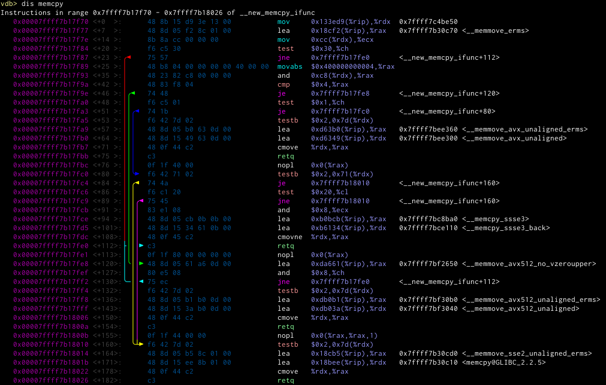

# VDB
A set of python visual enhancements for gdb.

<!-- vim-markdown-toc GFM -->

* [VDB](#vdb)
	* [Overview](#overview)
	* [Quickstart](#quickstart)
	* [Disabling modules](#disabling-modules)
* [Modules](#modules)
	* [prompt](#prompt)
		* [Configuration](#configuration)
	* [backtrace](#backtrace)
		* [Commands](#commands)
			* [`bt`](#bt)
			* [`bt/r`](#btr)
			* [`bt/f`](#btf)
			* [`backtrace`](#backtrace-1)
	* [vmmap](#vmmap)
		* [Commands](#commands-1)
			* [`vmmap`](#vmmap-1)
	* [register](#register)
	* [hexdump](#hexdump)
		* [Commands](#commands-2)
			* [`hd`](#hd)
	* [asm](#asm)
		* [Commands](#commands-3)
			* [`dis`](#dis)
			* [`dis/d`](#disd)
			* [`dis/r`](#disr)
* [global functionality](#global-functionality)
	* [shorten](#shorten)
* [Configuration](#configuration-1)
	* [gdb config](#gdb-config)
	* [Color settings](#color-settings)
		* [colorspec](#colorspec)
* [Plugins](#plugins)
* [Themes](#themes)

<!-- vim-markdown-toc -->
<!--
#VDB
-->

## Overview
vdb aims to display as much information as it can without cluttering the
display. It can filter and colorize output, and when the terminal isn't enough
anymore it creates dot graphs and images.

It tries to be as minimally invasive as possible, allowing to disable certain
modules and commands to not interfere with other python plugins.

## Quickstart
First clone the repo
```
git clone https://github.com/PlasmaHH/vdb.git
```
Install dependencies from the `requirements.txt` or install as a package.
Then add this to your `~/.gdbinit`
```
source ~/git/vdb/vdb.py
vdb start
```

## Disabling modules
There is one boolean gdb option per module. Setting those to off before `vdb
start` will prevent the corresponding module from being loaded. Once loaded a
module cannot be unloaded.
```
vdb-enable-prompt
vdb-enable-backtrace
vdb-enable-register
vdb-enable-vmmap
vdb-enable-hexdump
vdb-enable-asm
```
Additionally there is the gdb config 
```
vdb-available-modules
```
available which will not only allow for a more concise way to disable modules, it will also control the order in which
they are loaded. Must be set before a vdb start and contains a comma separated list.

The drawback however is that you will miss out new modules when updating, as they are not in the list.
# Modules
## prompt
This module allows you to configure the prompt to display more information.

For now this only sets the prompt to `vdb> ` in a certain colour. In the future we will add more information about the
currently running program or core file, maybe we can hack together a good multiline or airline prompt.
XXX Maybe as a first one the thread that is selected, as for breakpoints or other things this changes unintuitively.
Maybe also add a feature to autoselect a thread or a frame (given by some complex path?)
### Configuration

* `vdb-prompt-colors-text` The colour of the whole standard prompt
* `vdb-prompt-text` The text of the prompt, defaults to `vdb> `

## backtrace
We provide a backtrace decorator we various colouring options. It will also who some information about whether something
is inlined or some information about signals and crashes.


* `vdb-bt-colors-namespace` Colour all namespace names (for the purpose of this plugin, this includes class type names)
* `vdb-bt-colors-address` Addresses in the address column. Set this to none to use the global pointer colours by memory area type.
* `vdb-bt-colors-function` Function name (without any namespace and template parameters)
* `vdb-bt-colors-selected-frame-marker` The marker that shows which frame gdb has currently selected
* `vdb-bt-colors-filename` The filename (and line number) of the source code for this frame
* `vdb-bt-colors-object-file` The object file, in case the file and line numbers are unavailable
* `vdb-bt-colors-default-object` In case the two above could not be determined, show whatever gdb would have shown per
  default (usually the object name)
* `vdb-bt-colors-rtti-warning` Sometimes gdb can't properly access the RTTI information. While we try to be as good as
  possible in recovering it, gdb outputs warnings. They are usually suppressed and just a small string displayed in this
  colour.

Addresses (in the address column) is some special biest. Since the gdb decoration mechanism only allows us to return
integers/pointers, we are forced to hack around this by putting the strings elsewhere. There are situations  where this
can look funny. You can use the following setting to disable the colouring then. 
```
vdb-bt-color-addresses
```
Per default the colour is chosen by the
pointer color according to the colorspec (See section colorspec) below.
```
vdb-bt-address-colorspec
```
The showspec setting
```
vdb-bt-showspec
```


tells what should be displayed in the backtrace. Missing items are suppressed. The string can contain (in any order)
* `n` The frame number.
* `a` The address, coloured according to the above settings
* `f` or `F` the function name. For `F` we use the full name (minuse folds and shortens), for `f` we display just the
  name without any parameters or templates.
* `p` or `P` shows the parameters of the function. For `p` we only show the names, for `P` we also try to get gdb to
  print some values for them
* `s` shows the source of that frame. Can be a source file (with line) or some object file name.

You can also change the marker for the selected frame, this may be useful if your terminal does not support the utf8 character.
```
vdb-bt-selected-frame-marker
```
### Commands
We provide the following commands
#### `bt`
This should be your default. It will do all the filtering and sometimes write some additional data.
#### `bt/r`
This is like `bt` but disables the filter aka. raw. You should not see additional data, but the unfiltered plain gdb output.
#### `bt/f`
This is like `bt` but also passes the `full` parameter to backtrace to show all local variables per stackframe. These are not currently filtered.
#### `backtrace`
This is an unmodified gdb version, that is it is running the decorator, but not additional filters and outputs. It may be overridden by additional gdb plugins that you have. This has the added disadvantage that the `n` showspec doesn't have any effect, as well as the RTTI warning filter not working.

## vmmap
A module that allows access to the internal information of memory maps. It ties together information from the sources of
* `info files`
* `maint info sections`
* `info proc mapping`
### Commands
#### `vmmap`
Without parameters it shows a list of memory ranges and colours their addresses according to the memory types. The ranges can overlap. Additionally it shows section names and source files.

Different components of gdb provide different section names, if there is an alternative name it will be shown in []. Also the file information can differ, as some show the file name that was used to load, others dereference all symlinks.

As one of the parameters it accepts a colorspec, the other is an address. If the address lies within overlapping sections it will show the smallest matching section.
## register


## hexdump
This module provides a coloured hexdump of raw memory, possibly annotated in various ways.

### Commands

#### `hd`
This command dumps the range of memory specified by the parameter. If you omit the second size parameter, it will be set
to the value of `vdb-hexdump-default-len`. It will try to dump that many bytes, if along the way it reaches a point
where memory will not be accessible anymore, it stops.


If it knows the memory belongs to some symbol, it will colour it in a specific colour and annotate the symbol at the
side.

The setting
```
vdb-hexdump-colors-header
```
controls the colour of the header (the one that should make it a bit simpler to find certain bytes)
## asm
This is a disassembler module

### Commands

#### `dis`
This is a "plain" disassembly. It expects a gdb expression as a parameter that would be accepted by gdbs `disassemble`
command.

The displayed data can be controlled by the following showspec setting

```
vdb-asm-showspec
```

The order is fixed and the showspec entries mean the following:

* `m` Shows a marker (configured by `vdb-asm-next-marker`) for the next-to-be-executed instruction
* `a` Shows the address
* `o` Shows the offset
* `d` Shows a tree view of the known jumps in the current listing. They are coloured in a round robin fashion.
* `b` Shows the instruction bytes
* `n` Shows the mnemonic (along with its prefix).
* `p` Shows the parameters to the mnemonic
* `r` Shows a reference, this is mostly arbitrary text that the disassembler gave us (or text that we failed to parse properly)
* `t` or `T` Shows for jump and call targets the target name, run through the standard shorten and colour mechanism


The following settings control the colours
```
vdb-asm-colors-namespace
vdb-asm-colors-function
vdb-asm-colors-bytes
vdb-asm-colors-next-marker
vdb-asm-colors-addr
vdb-asm-colors-offset
vdb-asm-colors-bytes
vdb-asm-colors-prefix
vdb-asm-colors-mnemonic
vdb-asm-colors-args
```

If you set the addr colour to `None` (default) it will use the standard pointer colouring. If you set the mnemonic
colouring to `None` (default) it will use a list of regexes to check for which colouor to chose for which mnemonic. Same
for the prefix.

You have a little more control over the way offset is formatted by using the setting `vdb-asm-offset-format` which
defaults to `<+{offset:<{maxlen}}>:` where `offset` is the offset value and `maxlen` is the maximum width of an integer
encountered while parsing the current listing.



#### `dis/d`
Outputs the disassembler just like the plain format, additionally creates a `dis.dot` file that will contain a dotty
representation of what we think might be basic blocks and (conditional) jump instructions.

The following example is the same as the disassembler listing above. It doesn't use the `r` and `t` showspecs for
brevity.


The whole settings for colours of the terminal listing exist too for the dot ones, just append `-dot` to the setting
name. The showspecs are the same with the exception of the tree view.
#### `dis/r`
This calls the gdb disassembler without any formatting

# global functionality
There is some functionality used by multiple modules. Whenever possible we load this lazily so it doesn't get used when
you suppress loading of the modules that load it.
## shorten
There is a configurable way to shorten type names. We will have
* replacements, which plainly replace one string by another. (For now this is string replace only, maybe we should use
  regexes here)
* template folding. We have a list of types (or maybe we should use regexes here too?) that we mark and then we fold the
  complete list of template parameters into one empty list (and colour that).


# Configuration
The configurability is using two mechanisms. One is the gdb settings. Besides
the module loading settings, all settings are only available after a `vdb
start`.
## gdb config
Setting any string based configuration option to the special value `default` will reset it to the built in default. You
can set them in the .gdbinit file after the `vdb start` command, or you can provide a `~/.vdbinit` file that will be
sourced into gdb when it exists. When the setting <whatever we chose for it> is enabled, we will also read the
./.vdbinit after it, which can be project specific. If that doesn't exist we go down the filesystem until we either find
one, or we reach ~/ (which we already loaded) or /.

## Color settings
All modules that colour their output have settings of the form
```
vdb-<modulename>-color-<elementname>
```
to control the colour of their elements. You can use anything that the python ansicolors module can understand, that is
colours as css style (`#f0f` or `#ff00ff`) or named colours. Per default the colour is the foreground colour, but the
colour can also be a comma seperated list of foreground,background and style. As a style you can chose the standard ansi
style specifications like _underline_. Setting it to `None` will disable any ansi colouring for that element.

Alternatively the upcoming themes mechanism will provide a way to easily bundle all colour information into one python
file
### colorspec
The colorspec is a string made out of any of the following letters. It determines which mechanism will color a pointer.
The first matchin mechanism to return a color stops the search, if none is found, no coloring is done.

* `A` colours the pointer in case it is detected that the *pointer value itself* is a valid ascii (utf8) string. The
  heuristic for this isn't perfect but often good enough to easily detect that some pointer dereference got wrong.
* `a` this colours by the access type (see vmmap module)
* `m` this colours by the memory type (see vmmap module)
* `s` this colours by the section name (see vmmap module)

# Plugins
This is more an extended way to configure and hack things, but we may also provide hooks for extending the
functionality.

Each module has its own path in `~/.vdb/` where arbitrary python files can reside. Whenever the module is enabled by the
gdb setting, the files from that directory are imported. Similar to the `.vdbinit`, we search for a `.vdb` directory in
the current one, and all above that and load all the file we find there, stopping with the search once we found it.


Note to self: should we maybe have a setting that determines if we stop or continue loading? maybe three modes? stop,
forward and backward? So we can have global, project and subproject specific files that override each other?
# Themes
