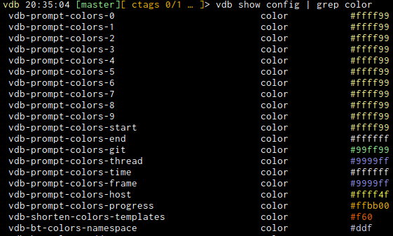

# VDB
A set of python visual enhancements for gdb.

---

**NOTE**
This is work in progress and mainly geared to what I use in my daily work as a C++ developer. This also means it will mostly require the
latest gdb version (12.0 as of writing this). Besides that it will most likely miss support for other platforms than C++
under x86_64 Linux with gcc > 10.

---

<details>
<summary>Expand TOC</summary>
<!-- vim-markdown-toc GFM -->

* [VDB](#vdb)
	* [Overview](#overview)
	* [Quickstart](#quickstart)
		* [Installation](#installation)
			* [Manually](#manually)
			* [Python Setup](#python-setup)
	* [Disabling modules](#disabling-modules)
	* [Caveats](#caveats)
* [Modules](#modules)
	* [prompt](#prompt)
	* [backtrace](#backtrace)
	* [vmmap](#vmmap)
	* [register](#register)
	* [hexdump](#hexdump)
	* [asm](#asm)
	* [pahole](#pahole)
	* [dashboard](#dashboard)
	* [ftree](#ftree)
	* [hashtable](#hashtable)
	* [ssh](#ssh)
	* [track](#track)
	* [types](#types)
	* [unwind](#unwind)
	* [history](#history)
	* [profile](#profile)
	* [va](#va)
	* [llist linked list tools](#llist-linked-list-tools)
	* [pipe](#pipe)
* [global functionality](#global-functionality)
	* [shorten](#shorten)
	* [pointer (chaining)](#pointer-chaining)
	* [memory layout](#memory-layout)
	* [type layout](#type-layout)
* [Configuration](#configuration)
	* [gdb config](#gdb-config)
	* [examine configuration](#examine-configuration)
	* [Color settings](#color-settings)
		* [colorspec](#colorspec)
* [Plugins](#plugins)
* [Themes](#themes)
* [Troubleshooting](#troubleshooting)
	* [Python encoding errors](#python-encoding-errors)
* [TODO](#todo)

<!-- vim-markdown-toc -->

</details>

## Overview
vdb aims to display as much information as it can without cluttering the
display. It can filter and colorize output, and when the terminal isn't enough
anymore it creates dot graphs and images.

It tries to be as minimally invasive as possible, allowing to disable certain
modules and commands to not interfere with other python plugins.

## Quickstart
First clone the repo
```
git clone https://github.com/PlasmaHH/vdb.git
```
### Installation
#### Manually
Install dependencies from the `requirements.txt` or install as a package.
Then add this to your `~/.gdbinit`
```
source ~/git/vdb/vdb.py
vdb start
```
#### Python Setup
Using python setuptools one can simply run
```
sudo python ./setup.py install
```
and then edit `~/.gdbinit`
```
source /usr/bin/vdb.py
vdb start
```

---
In case a dependency is not available, the module needing it will not load, but all others should. In practice this
means screens full of error messages and a limited feature set, but for a lot of modules plain pyhton is enough. The
most notable exception though is the ansicolor module which of course  is necessary since basically all features are
about colours.
## Disabling modules
There is one boolean gdb option per module. Setting those to off before `vdb
start` will prevent the corresponding module from being loaded. Once loaded a
module cannot be unloaded.
```
vdb-enable-prompt
vdb-enable-backtrace
vdb-enable-register
vdb-enable-vmmap
vdb-enable-hexdump
vdb-enable-asm
```
Additionally there is the gdb config 
```
vdb-available-modules
```
available which will not only allow for a more concise way to disable modules, it will also control the order in which
they are loaded. Must be set before a vdb start and contains a comma separated list.

The drawback however is that you will miss out new modules when updating, as they are not in the list.

## Caveats

Due to the somewhat incomplete nature of gdb events and scripting API we are forced to use gdb script command hooks for
some of our functionality. Since they do not chain on their own, it might be that it interferes with other plugins, so
either their hooks or our hooks do not work. This is especially true for the track module.

# Modules
## prompt
This module allows you to configure the prompt to display more information. Some modules will use it to display some additional information. Per default you will get the time, and a little bit extra when a file is loaded, also a bit of git information when available.


[You can find detailed information about this module here](doc/PROMPT.md)
## backtrace
We provide a backtrace decorator with various colouring options. It will also show some information about whether something
is inlined or some information about signals and crashes. You can configure which parts of the backtrace will be
displayed for more concise displays.


[You can find detailed information about this module here](doc/BACKTRACE.md)

## vmmap
A module that allows access to the internal information of memory maps. It ties together information from the sources of
* `info files`
* `maint info sections`
* `info proc mapping`

[You can find detailed information about this module here](doc/VMMAP.md)
## register

This is an `info reg` on steroids.


[You can find detailed information about this module here](doc/REGISTER.md)
## hexdump

This module provides a coloured hexdump of raw memory, possibly annotated in various ways.


[You can find detailed information about this module here](doc/HEXDUMP.md)
## asm
This is a disassembler module. It allows a bit better control over the disassembled output, adds a bit of colour and can
optionally try to create a basic block flow graph, even in a lot of cases being able to figure out jump tables.


[You can find detailed information about this module here](doc/ASM.md)

## pahole
This is an enhanced and redone version of the pahole python command that once came with gdb. It has support for virtual
inheritance and a possibly more useful layout display.


[You can find detailed information about this module here](doc/PAHOLE.md)

## dashboard

With this module you can automatically execute commands and have them output to different targets than the current
terminal.
[You can find detailed information about this module here](doc/DASHBOARD.md)
## ftree
The ftree module allows for creation of dotty files that create a tree (or directed graph) out of a datastructure.


[You can find detailed information about this module here](doc/FTREE.md)

## hashtable
One of the most common datastructures for quick dictionary lookups are hashtables. One of the most common problems with
them is bad hashfunctions, or data structured just in the wrong way for the chosen hashfunction. You end up with
hashtables with a lot of collisions where there do not need to be some. This module allows you to visualize the data and
gain more insight about it.


[You can find detailed information about this module here](doc/HASHTABLE.md)

## ssh
We provide some "remote debugging" features that are based around logging into another host via ssh and debugging
something there (a live process or some core file). 

[You can find detailed information about this module here](doc/SSH.md)

## track

The `track` command allows you to track the data of gdb expressions on hitting breakpoints. While this module is active,
whenever a breakpoint is hit an internal callback will be called, this may be a performance issue for some. All
breakpoints that have a trackpoint attached will automatically continue when hit, making data collection an automated
task.


[You can find detailed information about this module here](doc/TRACK.md)
## types
The `types` module allows to load/create type information on the fly while debugging. Good for when you don't have debug
information.

[You can find detailed information about this module here](doc/TYPES.md)

## unwind
This `unwind` module contains a custom (disabled by default) unwinder that allows to tweak a bit the information
gathered in each frame. 
[You can find detailed information about this module here](doc/UNWIND.md)


## history
The `history` module deals with the gdb command history. It can emulate an fzf like command history search in a somewhat
awkward way due to gdb limitations.
[You can find detailed information about this module here](doc/HISTORY.md)


## profile
Allows to profile python calls

[You can find detailed information about this module here](doc/PROFILE.md)

## va
Allows you to inspect variable argument functions
[You can find detailed information about this module here](doc/VA.md)
## llist linked list tools
A command and toolset to go through linked lists of various kinds and show the content of given structures in a concise
way.
[You can find detailed information about this module here](doc/LLIST.md)
## pipe
The pipe module offers the possibility to pass the output of our commands to external tools via simple shell piping
syntax. Currently enabled commands are
```
vdb-pipe-commands = grep,egrep,tee,head,tail,uniq,sort,less,cat
```

Additionally we provide very thing wrappers around the following existing commands
```
vdb-pipe-wrap = show,info,help,x,print,list,set
```

These wrappers create new commands with the same name but starting with an uppercase letter. These will behave more like
vdb commands and support piping. Note that you always need to specify the full command, that is `pr` instead of `print`
will not work generally. For an example see [examine configuration](#examine-configuration)

```
vdb-pipe-externals
```
This is an easy list of external commands. If not specified anything, the binary file name will be placed as an
additional argument. You can place after a `:` additional default arguments and/or embed `{file}`  inside there. Ending
the command just in `:`  will suppress the file passing. You can always put additional arguments.

# global functionality
There is some functionality used by multiple modules. Whenever possible we load this lazily so it doesn't get used when
you suppress loading of the modules that load it.

## shorten
There is a configurable way to shorten type names. We will have
* replacements, which plainly replace one string by another. (For now this is string replace only, maybe we should use
  regexes here)
* template folding. We have a list of types (or maybe we should use regexes here too?) that we mark and then we fold the
  complete list of template parameters into one empty list (and colour that).

[You can find detailed information about this module here](doc/SHORTEN.md)
## pointer (chaining)
The submodule for pointer colouring supports chaining them as well, which will lead to a string of dereferenced pointers
until a determined length is reached or something useful is found. You can find examples in the register commands. It
uses internally the memory layout module. 

You can change the left and right arrows, an ellipsis and an infinity arrow (for things pointing to itself) via the
`vdb-pointer-` configs for `arrow-right`, `arrow-left`, `ellipss` and `arrow-infinity`.

For the auto detection of ascii in pointer values, you can set the least amount of characters necessarys with
`vdb-pointer-min-ascii` (default is 4)

The value of `vdb-pointer-max-exponents` is a comma separated pair of exponents, for which the double detection
heuristic of pointer tails assumes that things are a valid double.

tailspec (means to stop pointer chaining here )

* a points to ascii
* x points to executable memory (shows instruction)
* n points to named object
* d points to double
* D is a double value itself

[You can find detailed information about this module here](doc/POINTER.md)

## memory layout
Provides information about the memory layout gathered from various sources. Primary source of information for the vmmap
command as well as the pointer colouring.

## type layout
This is the submodule that is responsible for parsing gdb type information and reconstructing an in-memory layout. This
is mainly used by the pahole command.

# Configuration
The configurability is using two mechanisms. One is the gdb settings. Besides
the module loading settings, all settings are only available after a `vdb
start`.
## gdb config
Setting any string based configuration option to the special value `default` will reset it to the built in default. You
can set them in the .gdbinit file after the `vdb start` command, or you can provide a `~/.vdbinit` file that will be
sourced into gdb when it exists. We will also read the
./.vdbinit after it, which can be project specific. If that doesn't exist we go down the filesystem until we either find
one, or we reach ~/ (which we already loaded) or /.

## examine configuration
The subcommand `vdb show config` can show all known vdb config objects nicely. It supports pipe commands. In case the
origins are recorded you can add `/v` to show the origin.

If you want to know which config values are not their default, use `/s` to show only those (in a format you can
copy/pate into a `.gdbinit` file.

All three versions accept an addition regexp as a parameter.



## Color settings
All modules that colour their output have settings of the form
```
vdb-<modulename>-color-<elementname>
```
to control the colour of their elements. You can use anything that the python ansicolors module can understand, that is
colours as css style (`#f0f` or `#ff00ff`) or named colours. Per default the colour is the foreground colour, but the
colour can also be a comma separated list of foreground,background and style. As a style you can chose the standard ansi
style specifications like _underline_. Setting it to `None` will disable any ansi colouring for that element.

Alternatively the upcoming themes mechanism will provide a way to easily bundle all colour information into one python
file
### colorspec
The colorspec is a string made out of any of the following letters. It determines which mechanism will color a pointer.
The first matching mechanism to return a color stops the search, if none is found, no coloring is done.

* `A` colours the pointer in case it is detected that the *pointer value itself* is a valid ascii (utf8) string. The
  heuristic for this isn't perfect but often good enough to easily detect that some pointer dereference got wrong.
* `a` this colours by the access type (see vmmap module)
* `m` this colours by the memory type (see vmmap module)
* `s` this colours by the section name (see vmmap module)

# Plugins
This is more an extended way to configure and hack things, but we may also provide hooks for extending the
functionality.

Each module has its own path in `~/.vdb/` where arbitrary python files can reside. Whenever the module is enabled by the
gdb setting, the files from that directory are imported. Similar to the `.vdbinit`, we search for a `.vdb` directory in
the current one, and all above that and load all the file we find there, stopping with the search once we found it.

Although we do not have a proper stable API yet, most of the modules can be imported and used and will likely work that
way for a long time. If something breaks, usually there is a different way now to do it, it will be unlikely that we
ever really remove functionality (unless gdb removes it)

# Themes
Themes are not really special files themselves, they are python plugins that provide a package of all the necessary code
to change colours to a specific predetermined set. Unlike all the other plugins, themes are selectively loaded, thus you
can have many in the subdirectory, they will all be ignored, just the one configured not.

You can set the theme by setting

```
vdb-theme
```

to the name of the theme/python module to load from the directory `$HOME/.vdb/themes`. You don't specify the `.py`
ending, but the file must have it. Themes will be loaded when you do `vdb start` (most likely in your `.gdbinit`).
# Troubleshooting

## Python encoding errors

Sometimes when starting gdb with vdb enabled, you may be faced with the following (or similar) error message:

```
UnicodeEncodeError: 'ascii' codec can't encode character '\u2192' in position 1: ordinal not in range(128)
```

This is caused by the python within gdb starting up with ascii instead of utf-8 as the default encoding. Setting
`LC_ALL` to a utf8 value will usually fix this, if in doubt which to chose (especially when not set)

```
export LC_ALL=C.UTF-8
```

is usually a safe bet.
# TODO
There are a lot of ideas and enhancements that are possible or need to be done. Among them are:

* support for other architectures than x86_64 (maybe generic with all values from gdb, even with register autodetection)
* Add some API to make it easier for people to programmatically create those annotations for buffers.
* symbol position and size caching
* clearing of caches on events that might have changed it.
* generic mechanism for hashtable load images and calculations
* Extract information out of the allocator. With a proper middle layer we can support multiple versions. This could draw
  some maps of where free space and allocated space is.
* a stack inspector possibly based on the hexdump annotation mechanism. Try to identify pointers to known things, like
  local variables. Collect throughout all other function calls the information where some object is and display that too
  (maybe generically always in hexdump?). Mark local variables on the stack. Possibly annotate disassembly with that
  information too when available. Is it possible that other diassemblers can help us here? Cache things for function
  frames.
* Find a way to quicker get all typedefs and use global ones automatically for shortens. At the moment going through all
  of them via "info types" takes minutes.
* For the port output dashboards, maybe check if there is an easy way to find out what the connecting telnet is
  supporting
* Highlighting hooks for plugins to make addresses stand out more that the user wants to know about
* check if we can put probes to good use. They may be useful to integrate into the track mechanism
* asm, shorten, pahole and hex annotate use all a bit of the object layout for nested structures. We need to unify this
  properly to have repeatable names all around... 
