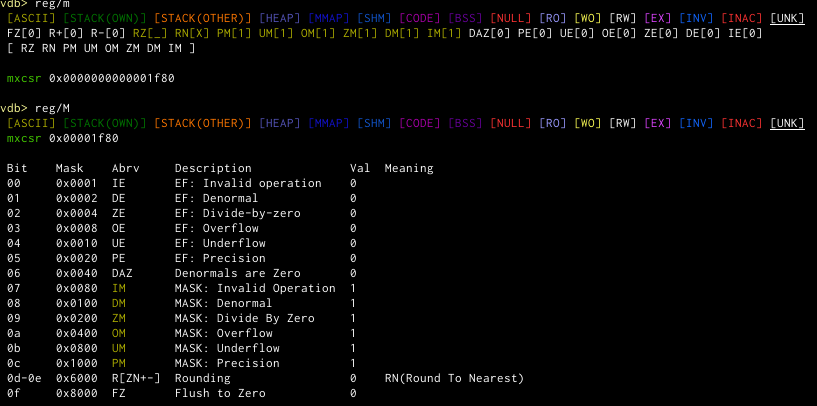

# Register module

This module is an `info reg` version on steroids. It will colour possible pointers according to the known memory layout
and will dereference pointers recursively as well as some other goodies.

## Commands

### `reg`
This command is like `info register` just with a bit more information and options. It can display the most basic
registers or an existed version of all registers. Just a hex value overview, or a detailed dereference chain. It
colours the pointer according to where they point to (see the legend of the command). It tries to detect when a pointer
value is invalid, but contains an ascii string instead (hints to it being read from re-used memory). It has the
following variants (and defaults to what is configured in `vdb-register-default`, which itself defaults to `/e`):

### `reg/<showspec>`
When the parameter isn't one of the special variants below, it will be interpreted as a showspec. Lower case letters
denote the standard (usually smaller) version, whereas uppercase letters denote the expanded version with more details.
Sometimes there is no difference, but to always provide an uppercase version we accept that too, and maybe in the future
we might add information at that point. `.` is always ignored, in which way you can work around ambiguities with the
below shortcuts.

If you want to show the integer value alongside the hex value of each register set `vdb-register-int-as-int` to true.

* `iI` show all the integer and general purpose registers, just like `info reg` does.
    

* `vV` show all the vector registers and try to make sense of them, tries to take the biggest version of registers that
  are overlaid. The mxcsr flags are shown too.

    
* `fF` show all the float registers and flags.

    

    (Note how you have to use `f.` to distinguish it from the "full" shortcut.
* `xX` shows the integer register [e]flags

    
* `pP` Shows the prefix/segment registers.

    
* `mM` shows the SSE MXCSR register.

    

### `reg/s` (short)
Same as `reg/ipx`.

### `reg/e` (expanded)
Same as `reg/Ipx`.

### `reg/a` (all)
Same as `reg/ixfpmv`.

### `reg/f` (full)
Same as `reg/IXFPMV`.
(not yet implemented)

