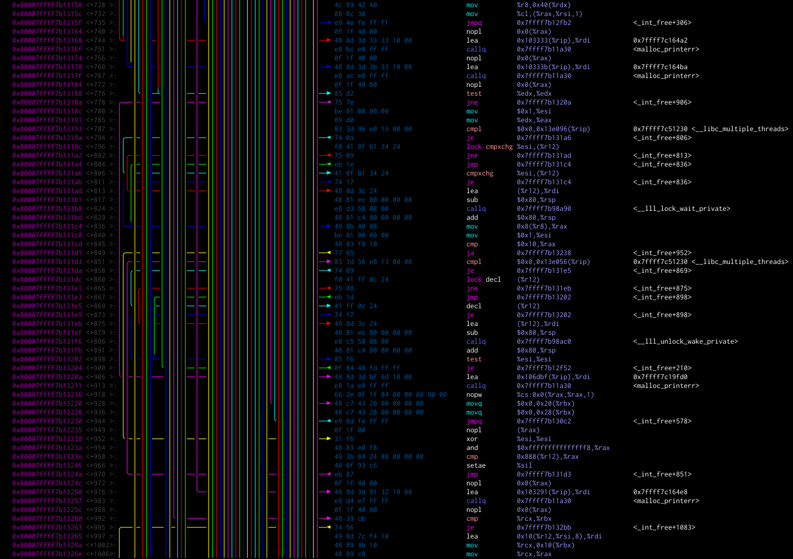
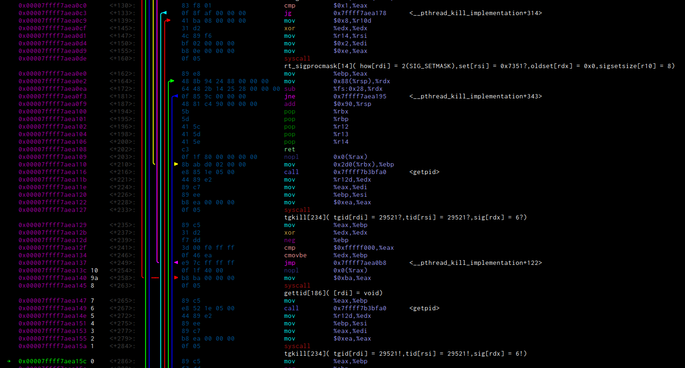
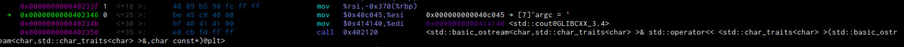
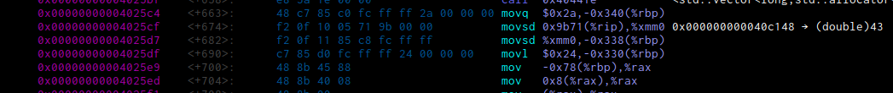
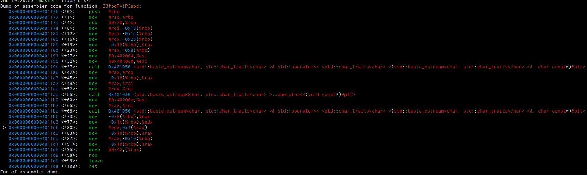
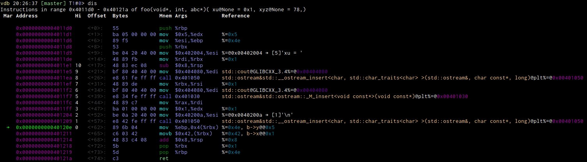

# asm module
This is a disassembler module. It allows a bit better control over the disassembled output, adds a bit of colour and can
optionally try to create a basic block flow graph, even in a lot of cases being able to figure out jump tables.

## Commands

### `dis`
This is a "plain" disassembly. It expects a gdb expression as a parameter that would be accepted by gdbs `disassemble`
command. Additionally you can specify a range of bytes to disassemble. Unlike the gdb builtin disassembler it will
per default accept any address that is not in a known function. You can use `vdb-asm-nonfunction-bytes` to chose how
many bytes per default are being displayed (gdb cannot know, since its not within a function, it has no idea when it
ends)

The displayed data can be controlled by the following showspec setting

```
vdb-asm-showspec
```

The order is fixed and the showspec entries mean the following:

* `m` Shows a marker (configured by `vdb-asm-next-marker`) for the next-to-be-executed instruction
* `a` Shows the address
* `o` Shows the offset
* `d` Shows a tree view of the known jumps in the current listing. They are coloured in a round robin fashion. It tries
  to detected computed jumps but isn't very good in it.
* `b` Shows the instruction bytes
* `n` Shows the mnemonic (along with its prefix).
* `p` Shows the parameters to the mnemonic
* `r` Shows a reference, this is mostly arbitrary text that the disassembler gave us (or text that we failed to parse properly)
* `t` or `T` Shows for jump and call targets the target name, run through the standard shorten and colour mechanism
* `j` shows a reconstructed possible history for the origin of the flow path
* `h` or `H` shows a listing of the history of executed instructions when instruction recording was enabled. Using `vdb-asm-history-limit` you can chose the number of histories printed for each instruction
* `c` Shows a callgrind information column (see [callgrind](#callgrind) for details)


The following settings control the colours
```
vdb-asm-colors-namespace
vdb-asm-colors-function
vdb-asm-colors-bytes
vdb-asm-colors-next-marker
vdb-asm-colors-marker
vdb-asm-colors-breakpoint-marker
vdb-asm-colors-addr
vdb-asm-colors-offset
vdb-asm-colors-bytes
vdb-asm-colors-prefix
vdb-asm-colors-mnemonic
vdb-asm-colors-args
vdb-asm-colors-variable
vdb-asm-colors-location
vdb-asm-colors-explanation
```

Additionally `vdb-asm-colors-jumps` is a semicolon separated list of colours to use for the jump tree view.

If you set the addr colour to `None` (default) it will use the standard pointer colouring. 
If you have `vdb-asm-next-mark-pointer` set then the address at the marker is written in the marker colour.
If you set the mnemonic
colouring to `None` (default) it will use a list of regexes to check for which colour to chose for which mnemonic. Same
for the prefix.

You have a little more control over the way offset is formatted by using the setting `vdb-asm-offset-format` which
defaults to `<{offset:<+{maxlen}}>:` where `offset` is the offset value and `maxlen` is the maximum width of an integer
encountered while parsing the current listing.


In case your tree view is very wide, you might
like setting the option `vdb-asm-tree-prefer-right` to make the arrows prefer being more on the right side.


Sometimes the display gets a little bit complex:


There isn't too much you can do, but adding more colours sometimes helps to distinguish the arrows better.

Per default the instructions are sorted by address. You can disable that by setting `vdb-asm-sort` to `False` to make
them appear in the order gdb produces them, which will however break jump arrows in case you have functions in multiple
chunks and reverse order.

### `dis/<context>`
This limits the displayed disassembly to the context of the passed amount of lines around the `$rip` marker. Should
there be no such marker, this has no special effect. Note that the whole disassembly will be generated, filtered, and
rendered (at least partially), just the output of the other lines suppressed, so if you want this for speedup, this
isn't for you. The benefit however is that the jump tree view will be completely fine.

Context can be chosen as follows (of course if there is not enough context available it will be cut of)

* `N` adds N lines of context before and after the marker
* `N,M` adds N lines before and M lines after the marker
* `+N` adds N lines after the marker
* `-N` adds N lines before the marker

### `dis/d`
Outputs the disassembler just like the plain format, additionally creates a `dis.dot` file that will contain a dotty
representation of what we think might be basic blocks and (conditional) jump instructions. It will also try to start
dot with the command specified in `vdb-asm-`

The following example is the same as the disassembler listing above. It doesn't use the `r` and `t` showspecs for
brevity.


The whole settings for colours of the terminal listing exist too for the dot ones, just append `-dot` to the setting
name. The showspecs are the same with the exception of the tree view. The layout of graphviz can sometimes be a mess,
therefore we offer the following ways to influence things in the graph (besides colour):

* `vdb-asm-prefer-linear-dot` configures that the layout should give priority to the order of instructions when laying
  out the graph (makes dot edges unconstrained for non consecutive instructions). Can get a bit messy when there are
  unconditional jumps.
* `vdb-asm-font-dot` is a comma separated list of fonts. It is embedded int the `.dot` file and the exact format depends
  on how your graphviz is compiled, on the majority of the system it should be the names you can get via `fc-list`.
### `dis/r`

This calls the gdb disassembler without any formatting

## Configuration

We have a variety of configurations that control how we output things

* `vdb-asm-header-repeat` controls how and if a header should be printed
  * `<0` only prints the header once at the top
  * `0` disables printing the header
  * `>0` prints the header every N lines
* `vdb-asm-debug-registers` shows additional information about possible register values
* `vdb-asm-debug-all` shows all sorts of debug information (may break formatting)
* `vdb-asm-variable-expansion-limit` Limits the depth of subobject expansions for local variables.

### breakpoints

In most contexts the existing breakpoints will be displayed as a dot in the marker column. You can configure the colour,
as well as the character used for it ( `vdb-asm-breakpoint-marker` and `vdb-asm-breakpoint-disabled-marker` for disabled
ones). For the first 10 breakpoints the settings `vdb-asm-breakpoint-numbers` ( and
`vdb-asm-breakpoint-numbers-disabled` ) controls alternative characters to be used. Their usage is controlled by the
`vdb-asm-breakpoint-use-numbers` setting. When enabled, breakpoints that go beyond the numbers characters will simply be
represented by numbers. You can also leave the numbers setting empty, in which case numbers will be used for all
breakpoints.

## Information enhancement functionality

### syscall

We can also try to display some syscall informations. Not all is functional yet as it requires a lot of information to
be transferred and be kept up to date. Best is we just look at an example.



We have four syscalls displaying here. The code knows for each number (passed in `eax`) the name and some parameters.
For a bunch of parameters it can also determine bitmasks or similar, as well as constants (see the code for more
information. There you can also see how to potentially add to those structures from your own plugins).

It tells you for each parameter in which register it should be, and what value it thinks the register has at the point
of calling. There are certain cases to distinguish:

* It is totally sure where the value comes from. You can see that for the `rt_sigprocmask`  syscall, how `edi` is filled
  and `edx` is zeroed out. In that case no further marker is displayed.
* `?` If the register value at that point is not totally known, it is marked with a question mark. The further away the
  currently executed instruction is, the more likely it is that these values are wrong because they have been
  overwritten. Be very careful.
* `!` When we are very sure that the value in the register has not been overwritten yet, we mark it with an exclamation
  mark. We could still be wrong, e.g. because we did not see a jump from a totally different place, or the syscall
  returned and messed up the registers, but usually the values are right. Check for plausibility anyways.

### function calls
We plan to do the same we do with the syscalls with function calls, but its not yet usable.

### Mnemonics
Sometimes its hard to exactly recall what a mnemonic does or what the exact direction of the arguments are. For
selected/supported mnemonics ( and architectures ) setting `vdb-asm-explain` will enable a short sentence of explanation
for each supported assembler instruction.


### Jump annotations
When `vdb-asm-annotate-jumps`  is active, then all (detected and supported) conditional jump instructions will output
when they detected via register flow analysis whether the jump is being taken.

### constants
Whenever we load some constants into registers or similar, we annotate them as good as we can. Mostly this will be a
pointer chain or similar, as well as using pointer colours. For this we make use of the tailspec, that is stored in the
`vdb-asm-tailspec` configuration (see  documentation for pointer chaining)



Here you can see how the `std::cout` object and the `argc = ` string are loaded into the registers and the `operator<<`
is called, so you can see that this most likely amounts to the C++ code of `std::cout << "argc = "` possibly followed by
more.



Here you can see how a constant is loaded from a data section in a position independent way (using `rip` in the
calculation). The heuristic detected that it is most likely a double of the value `43`.

### Variables

As long as the frame setup is still in tact, we can extract some useful information about the local variables and
function parameters and try to display it alongside all the other information. Compare the stock disassembly of the
following test program with the vdb enhanced version. The information displayed is to give you a rough overview, keep in
mind that due to various circumstances (especially those leading to data corruption crashes) the displayed information
may be wrong.

Especially when you use optimized binaries, a lot of assumptions we make will not always hold, and the quality of the
recovered information is lower, especially if there is no frame setup and `rbp` is used as a general purpose register.

```
#include <iostream>

struct bar {
        int x;
        int y;
};
struct abc {
        double d;
        double f;
};
void foo( void* xu, int xyz, abc* a ) {
        bar* b = (bar*)xu;
        std::cout << "xu = " << xu << "\n";
        b->y = xyz;

        char* c = (char*)xu;
        *c = 0x42;
}
int main(int argc, const char *argv[]) {
        abc a;
        foo((void*)argc,78,&a);
}
```



While usually gdb demangles the function name, this time it didn't, we fixed that. We also added the registers and/or
stack storage information of the passed parameters. The detail information you can find here are:


* Function parameters. `xu@` tells at which address on the stack the variable is stored (or None if this has been
  optimized away) as well as its value ( `= 0x1` ). Additionally the rbp expression to access this variable
* Local Variables. You can see that `b` is stored at `-0x8(%rbp)` and its actual address.
* Immediates and call setup. One can see how `%esi` is filled from a constant to point to the string `'xu = '` and then
  `std::cout`is put into the next parameter and then `operator<<` is called, which we can clearly find in the source be
  the output of that string. The same for the value of the `xu` pointer as well as the final `'\n'` string.
* Variable accesses. Marked in green is the current instruction that crashed. We can see that vdb identified it as an
  access to `b->y` and says that this would access `@0x5` which we can see in the backtrace segfault message being the
  address that caused the crash.

Usually (here too) variables values after the current instruction are displayed wrong, since we read them right out of
the memory and the instructions writing the correct values to the memory have not been executed yet.

### Argument output specification
Setting `vdb-asm-default-argspec` controls a bit in which way the assembler instructions output their register values.
Some mnemonics can override this default. It is a comma seperated entry, first for the registers that are deemed input,
second registers that are deemed output of the instruction.

Valid values are:
* `i` Says to use the possible input registers of this instruction
* `o` Says to use the output registers instead
* `@` For an instruction that dereferences some address, this will show the address
* `=` This will show the value of the dereferenced address
* `%` When the target is a register, this will display its value

#### debugging the register tracing

How do we do this? Internally we try to recover and follow the register values. This does not always work fine, values
may not be available or we make mistakes. Therefore you can set `vdb-asm-debug-registers` to on, to show a lot more of
the information about which registers we think have which values.

There is also a special `dis/v <varname> <register> <value>` command that you can use to specify the value (and
association to a variable) of a register at the start of the currently selected frames function. Use this mostly when
core gdb itself was unable to provide the information about that variable (i.e. it is not part of `info locals`)

### callgrind

Using the `c` showspec and loading a callgrind output file via `dis/c callgrind.xxxx.out` will try to read in the
callgrind output file and then display some information in an extra column. The file contents will be cached, reading
the file in again will overwrite existing entried, however if there are no numbers in the new file and there have been
in the old, those will still be displayed and may be confusing. Therefore it is recommended to do a 

```
dis/c clear
```
prior to loading a new file.

Using the option 


```
vdb-asm-callgrind-events
```

one can specify a comma separated list of event columns to be displayed. These events are those from the `event:` line
of the callgrind file. Typical events are (depening on whether callgrind ran with collecting them ):

 * **Ir** Instruction Fetch
 * **Dr** Data Read Access
 * **Dw** Data Write Access
 * **I1mr** L1 Instr. Fetch Miss
 * **D1mr** L1 Data Read Miss
 * **D1mw** L1 Data Write Miss
 * **ILmr** LL Instr. Fetch Miss
 * **DLmr** LL Data Read Miss
 * **DLmw** LL Data Write Miss
 * **ILdmr**
 * **DLdmr**
 * **DLdmw**
 * **Bc** Conditional Branch
 * **Bcm** Mispredicted Cond. Branch
 * **Bi** Indirect Branch
 * **Bim** Mispredicted Ind. Branch
 * **Ge** Global Bus Event
 * **Smp** Samples
 * **Sys** System Time
 * **User** User Time

Additionally we have (the same way as kcachegrind) synthesized events:

 * **L1m** L1 Miss Sum
 * **LLm** Last-level Miss Sum
 * **Bm** Mispredicted Branch
 * **CEst** Cycle Estimation

In case the jumps are recorded, they will be displayed when the `c` showspec for disassembly is active as well as the
`vdb-asm-callgrind-show-jumps` setting is enabled.

## Troubleshooting

### Slow output with lots of jumparrows

When using pagination, gdb parses all the output and tries to properly word wrap. It does that even when word wrap is
not necessary.
Worse, somewhere around version 12 gdb started parsing all output always, even when pagination is not actiavted. This
causes sometiems a factor of 120 of slowdown.

To workaround this, one can enable the `vdb-asm-direct-output` setting to directly write things to stdout. This has one
major drawback though, it means the output will not be captured by any string capture mechanism. We therefore try to do
it only when the `dis` command does have `from_tty` set to true, but sometimes this doesn't work properly. In this case
you might want to try disabling this workaround.

## TODO

* document a few missing settings
* enhance computed jump detection to be reliable
* gather more information about branches in single stepping and display them
* integrate a different disassembler
* allow search for specific instructions, first figure out what would be most useful here
* remove from a context the jump lines that are not intresting
* generally support for more than x86_64
* add a better way to colour the mnemonics, best in a way that we can have nicer themes

