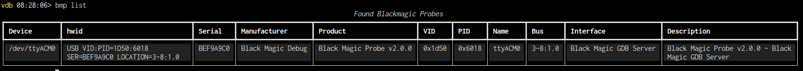

# BMP - Black Magic Probe support

The black magic probe is an SWD/JTAG debugging adapter in a small USB formfactor. It shows itself as a serial device
that talks the gdbserver protocol directly, as such you do  not need any additional software like OpenOCD to use it.

It additionally provides another serial port conneted to a uart on the device. This is commonly used for SWO support.

> Automatic SWO support for this is on the very long todo list

## `bmp list`

This will go through all known serial ports and checks if one of them looks like a black magic probe gdbserver port

## `bmp attach`

This tries to be as smart as possible and connect to the probe and setting up vdb by

* Connecting to the first found probe as an extended target
* Asking the probe to scan for the first attached MCU
* When using `bmp/s` it will also try to match an SVD file to the detected MCU and load files

> Note: On certain linux distributions you may run  into permission issues for the port. Depending on how this works in
> the distro your user must be in the right group or a udev rule for the bmp must be created

# Configuration

* `vdb-bmp-scan-retries` retry this often to scan for an MCU before giving up
* `vdb-bmp-retry-delay` wait that much seconds between retries to give whatever you scan for time to wake up
* `vdb-bmp-all-mem-accessible` Normally the bmp does tell gdb that all but the flash and ram are inaccessbile. For SoCs
    this would block access to  peripheral and memory mapped things
