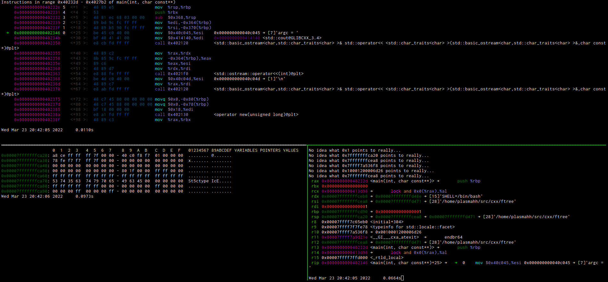

# Dashboards

Dashboards are a way to configure some output to be done on certain events to specific locations that display them
outside of the terminal gdb is running on. This is usually a terminal running in some other way. To be most flexible we
can output to ports (allowing you to also have the output in terminals on other hosts), ttys (and any file really) or
specific ttys on tmux panes.

Without any special trigger, the command will be executed always before a prompt is being displayed. When registering
the command via the API you can also call arbitrary python functions and display their return instead.


## Ports
`dashboard port <port> <command>`
or
`dashboard port <host>:<port> <command>`

will open a listen port and anyone connecting to it will get the output for that. If not specified the host will be
0.0.0.0 or :: depending on whatever python thinks. Anything that tries to format the output for a specific terminal
width will have no luck getting the width and thus do whatever it thinks is best.


## TTYs
`dashboard tty /dev/ptyXX <command>`

outputs to the specified tty, you can leave out the `/dev/` part if you want to. This is basically the same as the tmux
target, just that instead of a named tmux pane you chose the tty yourself. If unsure which tty a terminal you have open
is, just execute `tty` on that terminal.
## tmux panes
`dashboard tmux <pane-name> <command>`

The pane-name is a regex that will be applied to all tmux panes, and the first match is then taken, given it provides a
tty.

For extra convenience we have a tmux command that will directly forward all parameters to a tmux call, thus you can do a
`tmux list-panes` yourself easily to find a proper pane. We recommend though to have your (project specific) plugin
directories contain the settings to setup a dashboard. We provide some examples in the example `.vdb` directory that
will enable you to 

For example you can start a setup of tmux with
```
tmux new-session\; select-pane -T "disassembler" \; split-window -v\; select-pane -T "hexdump" \; split-window -h \; select-pane -T "registers"
```

and then use the example `.vdb/dashboard/tmux.py` file to fill it with commands to be executed.

## null target
The special target `null` will just ignore any command output and basically makes sure the command is executed each
time. This can be combined with the special `log` command that redirects all log output to that target.

## Special `log` command

Using the special `log` command, you can redirect a portion of the vdb output to certain targets. These outputs are
mostly those not generated as a result of an interactive command, such as status messages, certain kinds of warninigs
etc.

A useful combination is redirecting log output to null, so the output for testcases is only ever by the commands invoked
by the testcases.

## Other commands

* `dashboard show` Shows a list of all dashboards. The meaning of the columns is as follows:
    * __EN__ Y/N for being enable or not. 
    * __CLS__ Y/N for clearing the screen before outputting anything. The default. Disable this if you want to send two
      dashboards to one output.
    * __ID__ The numerical ID by which this entry is identified in any of the commands that need one.
    * __Type__ the type this was created as (tmux/tty/port)
    * __Target__ the type specific description of the target
    * __Event__ the (gdb) event on which this dashboards output is triggered. before_prompt is the default.
    * __Command__ the gdb command to execute. Its complete output will be redirected, no paging available.

* `dashboard enable/disable` Disables a dashboard. It will still be in the list, but not executed upon events. This may
  mean that something like an open port is still there.
* `dashboard delete` Completely remove the dashbaord, destroying all associated objects, usually closing listening ports
  etc.
* `dashboard [no]cls` Enables or disables the option to clear screen before starting the output. Clearing the screen is
  done via ansi escape sequences.
* `dashboard modify <id> <command>` modifies the command of the given ID to the new command string. Handy for fine
  adjusting layouts and stuff.

## Configuration
The boolean config option
```
vdb-dash-show-stats
```
will make all dashboard outputs be preceded by some internal statistics. For now they are the time it took in the
command to generate the output and the amount of output bytes. Later more might follow.

```
vdb-dash-auto-disable-time
```
when a command is detected to take longer than this much seconds, it will be disabled (Unfortunately currently there
does not seem to be a way to interrupt a running command, so we need to let it run for a while, and then disable it).
The default is 10 seconds.

With the option
```
vwd-dash-disable-silent
```
you can suppress any message when disabling a dashboard. This is useful when the dashboard has any catastrophic
malfunction and you want to disable it without ever sending data to it.


With the following settings you can append a time of day and execution to the dashboard to spot when it is not being
updated more easy (see the default for format options)
```
vdb-dash-append-time
vdb-dash-append-time-format
```
