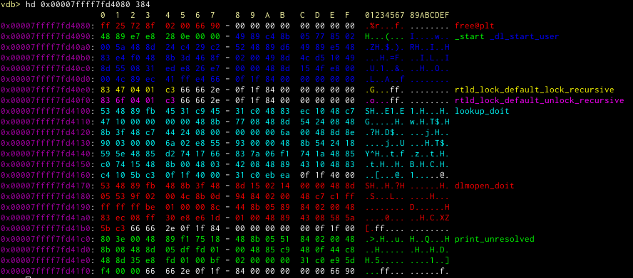

# hexdump module

Prints a hexdump of a specified range of memory. Depending on settings and information available it will colour pointers
and data. When you use this often, we recommend you put an alias `hd` for this into your `.gdbinit`.

## Commands

### `hexdump`
This command dumps the range of memory specified by the parameter. If you omit the second size parameter, it will be set
to the value of `vdb-hexdump-default-len`. It will try to dump that many bytes, if along the way it reaches a point
where memory will not be accessible anymore, it stops.



If it knows the memory belongs to some symbol, it will colour it in a specific colour and annotate the symbol at the
side. You can control the color with the semicolon separated list of colours in the `vdb-hexdump-colors-symbols` setting.

The setting
```
vdb-hexdump-colors-header
```
controls the colour of the header (the one that should make it a bit simpler to find certain bytes).

The option `vdb-hexdump-row-format` determines how a row looks like, you can reorder certain elements here.

### `hexdump/p[#]`

This version of the hexdump command tries to apply the same pointer dereferencing chain logic that is used to display
registers for a hexdump. It is assumed that the whole displayed hexdump is an array of (aligned) pointers and then it is
tried to interpret them. If they do not look in any way like a pointer however no additional output is generated. This
is added to the standard annotation of symbols. This is added to the standard annotation of symbols. An optional number
after this is interpreted as the maximum chain length for the pointer chains. It can also be set via the config option
`vdb-hexdump-default-chaindepth`. Furthermore the single chains are separated by `vdb-hexdump-pointer-chain-separator`.


### `hexdump/a`

Align the output to 16 byte boundaries.


Set
```
vdb-hexdump-default-align
```
to `True` to have that behaviour always on.


### `hexdump/v`

Value or verbose, whatever you like more. It will try to print a representation for known types at annotated parts of a
hexdump.

### `hexdump annotate`
```
Usage: hexdump annotate <addr> <len> <text> or <addr> <typename> or <varname> or frame
```
This command will add annotation to a specific range of memory. The first version adds a free manual text to a specific
address and length. It will always be displayed as long as some of those bytes are being displayed in any hexdump.
r
The second version takes an address and a typename. It will then extract the same information as `pahole` does and then
colour that specific memory always with these annotations. If then you use hexdump to dump a variable without a
specified size, it will be able to automatically take that size and dumps only that object.

The third version will take just the varname and tries to annotate that. The special varname frame can be used to try to
include all variables in the current frame.

Using the `frame` keyword, vdb will try to annotate all variables local to this frame.


(The debug output will likely vanish in a future version)

Note how in the places where there is a hole in the object only 'fd' is being displayed.

## Configuration

* `vdb-hexdump-repeat-header` (default 42) repeats the header every N rows (ideally set this to a value so that you
  always have a header in view)
