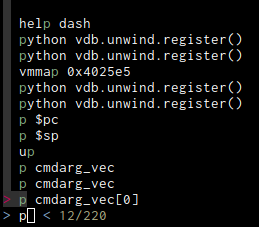

# Commands
gdb currently has no way to manipulate the history or command prompt in any way, so we have to do things a bit
roundabout.

## The `fz` command for fuzzy searching
The command on itself will do nothing, hitting tab twice though will reveal a fzf like search:



Basically searching there for `abc` will be more or less equivalent to the regexp `a.*b.*c`.

### Drawbacks
First of all, we cannot hijack `ctrl-r` from the readline. Secondly, we cannot put a complete new command line there.
What we do have instead is the original command prefixed by `fz `. This you can then either remove the `fz` prefix if
you like, or you can just press enter. The command will remove itself and execute again. 

This will of course add an entry with `fz` in the history, but when displaying the history, this prefix will always be
removed.

## Configurations

These options change the appearance of the various parts when searching
```
vdb-history-colors-marker
vdb-history-colors-background
vdb-history-colors-statistics
vdb-history-colors-prompt
vdb-history-colors-match
```

The maximum width of a string being displayed. A later verision should probably try doing it auomatically.
```
vdb-history-match-maxlen
```


To support case insensitive matching you can activate this (default is disabled)
```
vdb-history-match-case-sensitive
```

### Additional

We recommend to use 

```
set history size 4096
set history remove-duplicates 1
```

(or a higher history size) for better search and history experience.


