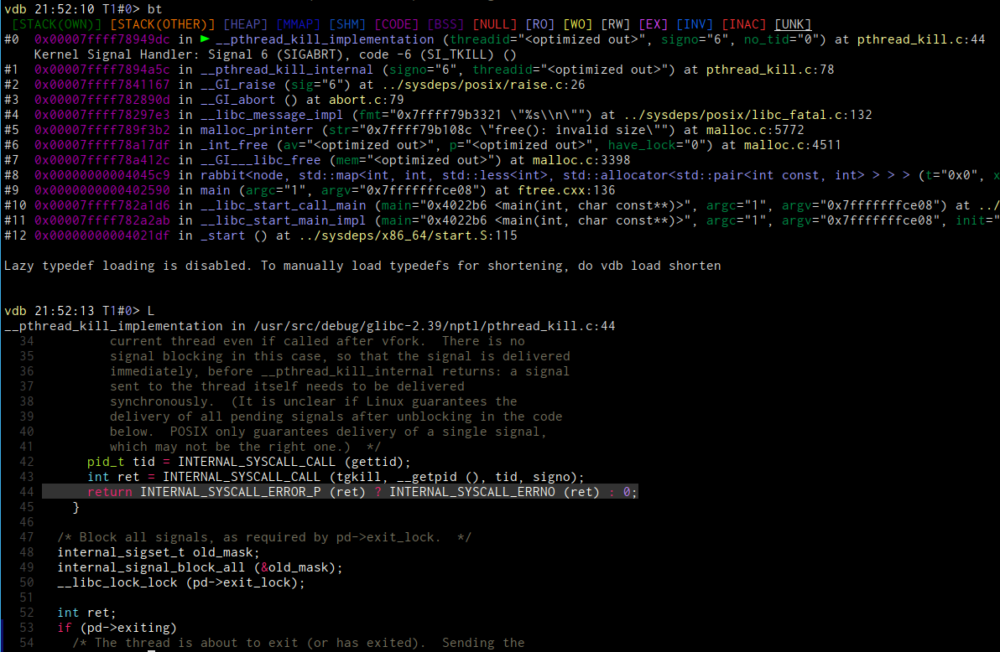

# list module

The list module contains an enhanced version of the gdb list command. Since we cannot redefine builtin commands, this
command is `List`. It supports the standard notation for context and will forward the actual display of the source to an
external command, per default `bat` ( which must be installed ).

## commands

### `List` 

You can specify the context as flags like for other commands, e.g. /5 for +-5 lines with a standard of 10 when not
specified. For the full file use `List/*`.

If applicable the current active line is highlighted.

As an additional parameter you can enter the source file name where we will try to find a matching file from the known
sources. If the wrong one is chosen enter a more complete path.

## configuration

src_command     = vdb.config.parameter("
### `vdb-list-source-command`

You can change the command used to render the code. The default is `bat -r {start}:{end} -H {line} {file}
--style=numbers --paging=never -f` where the mentioned variables will be substituted.

If this is empty/None then no command is used and the source code is just printed without any syntax highlighting.

marker_color    = vdb.config.parameter("
### `vdb-list-colors-marker`

In case of no external command being used the currently active line number will be printed in this colour.

### `vdb-list-default-context`

Contains the default context when List has no flags.
