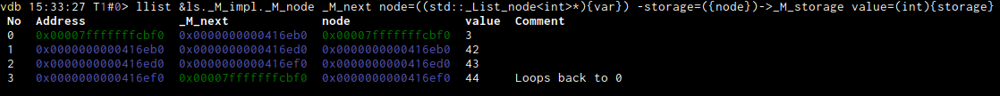

# The llist module

All commands produce a bit more outuput when `/v` is passed too.

## `llist <list> <next> [ a=b ]`

Although we have pretty printers available for std::list let us use one as an example. Imagine some `std::list<int> ls;`
that is filled with the values 42, 43, 44 ...

What we see here as parameters to the command is:

* `&ls._M_impl._M_node` The address of the first node of that linked list.
* `_M_next` the member of eacb node  leading to the next one
* `node=((std::_List_node<int>*){var})` this sets up a convenience variable called `node` that is everywhere replaced by
  the given gdb expression. Note how `{var}` is predefined to be the address of each linked list node as specified by
  all next pointers.
* `-storage=({node})->_M_storage` this sets up another convenienve variable `storage` but because it is preceded by a
  dash, it will not be displayed in the result table
* `value=(int){storage}` this is finally the variable we are interested in

As you can see, `std::list` uses a sential node approach where the list loops back to it. Intrestingly the storage of
that node is the cached size of the list.

## bidirectional mode
By specifying a convenience variable `prev` as the first one after the node and passing `/b` as a parameter, we will use
bidirectional mode and treat things as a doubly linked list. This way we can for such lists start at an arbitrary node
and work our way through both directions.

## `llist/s <addr> <addr or size>` (scan)

Passing an address and an end address (starting with 0x) or a size (just a plain base10 integer) the module will scan
through the address space given, and for each pointer it will test if there is a possible linked list present by
counting the chain length. It does that `vdb-llist-scan-max-offset` times, each time assuming the given offset of the
next pointer in a node structure.

Here (with increased output limit) we can find the previously mentioned `std::list` too, just as raw pointers. There are
also other appearant linked lists present, even with bigger chain lengths, so you might need to look aroud more when
searching for something meaningful. The weirdness with all the pointers going back and forth with various offsets comes
from the fact that this is a doulby linked structure and sometimes one and sometimes the other direction is picked up.

You can then use the typ module to create an artifical type and then the standard llist command to navigate and show the
datastructures. Strictly speaking you can probably hack together gdb expressions for the standard llist command too that
cast and do the same things...

## configuration

* `vdb-llist-default-list-limit` is the max number of members that will be displayed in the result list

## TODO
* Make easy commands to use the scan results as an input to the types module to create artifical types to easier
  display "raw" linked lists we don't have the structures for
* Make it possible to create presets that use stored expressions for linked lists to be conveniently (re)used (or as a
  starting point for further investigations)
* Think about if we should integrate tree support too, maybe with dot output and colourig support?
