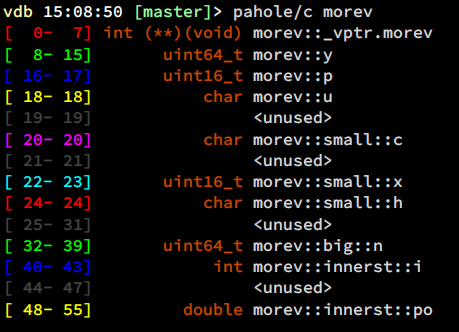
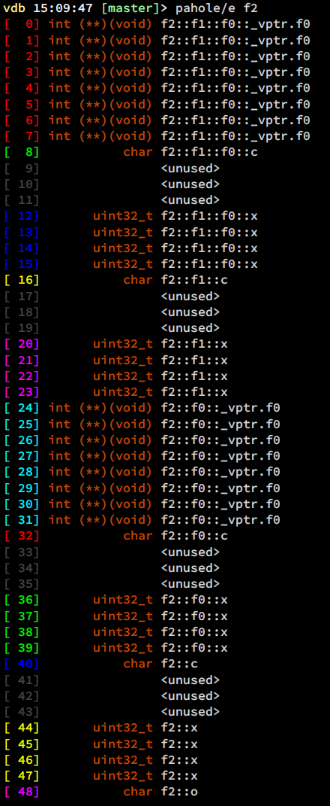
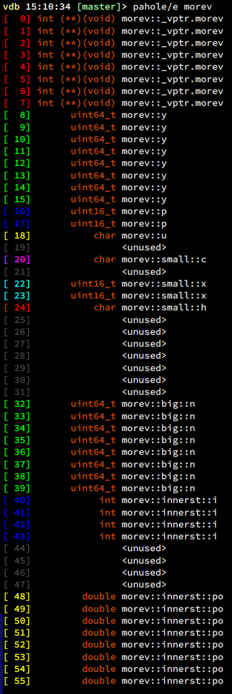

# pahole
This is an enhanced and redone version of the pahole python command that once came with gdb. It has support for virtual
inheritance and a possibly more useful layout display. While it now supports bitfields, it still has trouble with
unions ( and will mostly arbitrarily chose one of the possible values ).
Type names are shortened via the standard mechanism where possible.

## Commands

### `pahole`
This expects a type and can have one of two flavours, see below. Setting `vdb-pahole-default-condensed` will change the
default, but you can always override with `/c` or `/e`

The following examples are for the following code:
<table>
<tr>
<td>

```c++
struct f0 {
	char c;
	uint32_t x;
	virtual ~f0(){}
};

struct f1 : f0 {
	char c;
	uint32_t x;
	virtual ~f1(){}
};

struct f2 : f1,f0 {
	char c;
	uint32_t x;
	virtual ~f2(){}
	char o;
};
```
</td>
<td>

```c++
struct innerst {
	int i;
	double po;
};

struct small {
	char c = 'C';
	uint16_t x = 0x8787;
	char h = 'H';
};

struct big {
	uint64_t n = 0x7272727272727272;
};

struct morev : virtual small, virtual big, virtual innerst {
	uint64_t y = 0x4b4b4b4b4b4b4b4b;
	uint16_t p = 0x1515;
	char u = 'U';
};

```
</td>
</tr>
</table>


### `pahole/c`
This shows the types layout in a condensed format, one line per member, showing which bytes belong to it in the front




### `pahole/e`
This shows the layout in an extended format, one line per byte.





## Configuration

You have the following settings to influence the output

* `vdb-pahole-default-condensed` sets if `/c` or `/e` are default when not given
* `vdb-pahole-colors-members` A list of colors for the different members
* `vdb-pahole-color-empty` The color to use for empty space
* `vdb-pahole-color-type` The color to use for the type name

