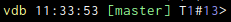

# Prompt Module

This module will control how the prompt looks like. You can completly replace the prompt, or augment it with extra bits
of information, or just rearrange it a bit.

## Known Problems

At times it interferes with the readline search functionality (CTRL-r) such that the display of the completed suggestion
is shifted around, especially when it would reach the end of the line.

## Base Configuration

The default config `vdb-prompt-base` controls how the prompt is assembled and is `{start}{0}{1}{2}{3}{4}{git}{5}{6}{7}{8}{9}{[:host:]}{end}` which will display `vdb>` and when you are inside a git repository reminds you of which branch you are in, if you enable git support.

An base configuration that uses everything could be `{start}{0}{1}{2}{3}{4}{time}{git}{5}{6}{7}{8}{9}{[:host:]}{ T:thread}{#:frame}{end}` and uses all mentioned features.

This might look like:

The single options of the base config are 

* `vdb-prompt-text-start` is `vdb` per default and replaces the `{start}` token of the prompt
* `vdb-prompt-text-end` is `> ` per default and replaces the `{end}` token of the prompt
* `vdb-prompt-text-#` is the tokens from 0-9 and allows you to add custom text by setting the variables like from within your own scripts.

## Colours
The token text colour of all tokens can be configured with a setting with the same name but with `colors` instead of `text` in its name. Some tokens have no text configuration as they are generated.

## Token Syntax

Each token is replaced by the corresponding content, and sometimes this is not available, for example the thread id is
not there when there is no progrma running. In order to display some custom text the tokens have the form of
{prefix:token:suffix} where prefix and suffix are displayed only when the token also has text. However only the token
itself is coloured in the configured colour.

For performance reasons all built in tokens will only create their value internally when it is part of the base configuration.

## Git support

When `vdb-prompt-git` is set to True, vdb will check which git branch you are in (and caches that information for 10
seconds) and display it under the `git` token.

The color config for this is `vdb-prompt-colors-git`

## Thread
Will display the current active thread, which is set via the `thread` gdb command (and can change when a breakpoint hits
or on a crash)

The color config for this is `vdb-prompt-colors-thread`
## Time
Displays the current time, at the point of printing the prompt. You can set `vdb-prompt-text-time` (default ` %H:%M:%S`)
to a python strftime string to change the format. 

The color config for this is `vdb-prompt-colors-time`
## Frame
Displays the number of the frame.

The color config for this is `vdb-prompt-colors-frame`

## Host
In case you are currently using the ssh module, this will display the host we are currently connected to.

The color config for this is `vdb-prompt-colors-host`

