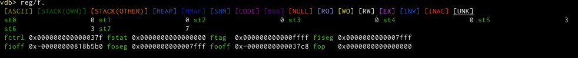
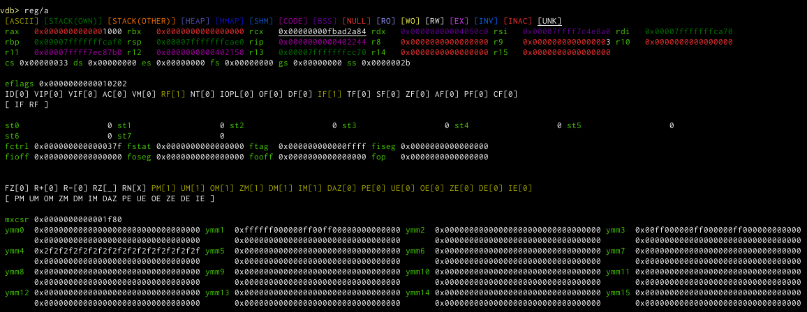

# Register module

This module is an `info reg` version on steroids. It will colour possible pointers according to the known memory layout
and will dereference pointers recursively as well as some other goodies.

## Commands

### `reg`
This command is like `info register` just with a bit more information and options. It can display the most basic
registers or an existed version of all registers. Just a hex value overview, or a detailed dereference chain. It
colours the pointer according to where they point to (see the legend of the command). It tries to detect when a pointer
value is invalid, but contains an ascii string instead (hints to it being read from re-used memory). It has the
following variants (and defaults to what is configured in `vdb-register-default`, which itself defaults to `/e`):

### `reg/<showspec>`
When the parameter isn't one of the special variants below, it will be interpreted as a showspec. Lower case letters
denote the standard (usually smaller) version, whereas uppercase letters denote the expanded version with more details.
Sometimes there is no difference, but to always provide an uppercase version we accept that too, and maybe in the future
we might add information at that point. `.` is always ignored, in which way you can work around ambiguities with the
below shortcuts.

If you want to show the integer value alongside the hex value of each register set `vdb-register-int-as-int` to true.
This makes things wider, so you usually want to set `vdb-register-short-columns` to a lower values (default 6).

* `iI` show all the integer and general purpose registers, just like `info reg` does.
    

* `vV` show all the vector registers and try to make sense of them, tries to take the biggest version of registers that
  are overlaid. The mxcsr flags are shown too.

    
* `fF` show all the float registers and flags.

    
* `xX` shows the known flags registers (like eflags and mxcsr)

    
* `pP` Shows the prefix/segment registers. `P` uses `$fs_base` or similar as a source and can be more correct when using
  TLS.

    
* `oO` Shows the remaining registers that did not fit into any of these groups (usually integers)

    

### `reg/s` (short)
Same as `reg/ipx`.

### `reg/e` (expanded)
Same as `reg/Ipx`.

### `reg/a` (all)
Same as `reg/ixfpmv`.

### `reg/E` (extended)
Same as `reg/IXFPMV`.

### `reg/m` and `reg/M` ( memory mapped registers )
Together with the svd module we support memory mapped registers. The `M` version shows an extended display of the
registers, `m` a condensed, similar to the flags registers.

Using `&` in front of the filter (which can be empty in that case) will cause the command to show the address where the
register resides at too.

Sometimes the memory is not accessible, in that case we will automatically blacklist that register and never try to
display it again. Set `vdb-register-mmaped-unavailable-zero` to instead use zero as the value for the register.
## Register filter
An additional parameter will most of the time be interpreted as a regexp filter.

## Settings
The settings `vdb-register-colors-names` and `vdb-register-colors-flags` will control the colour of the register name
and the text of flags if they are set.

`vdb-register-text-len` will define how wide the text of extended descriptions will be before wrapping ( if possible ).

`vdb-register-tailspec` controls the pointer specification ( see there ) to show for output that does chaining.

