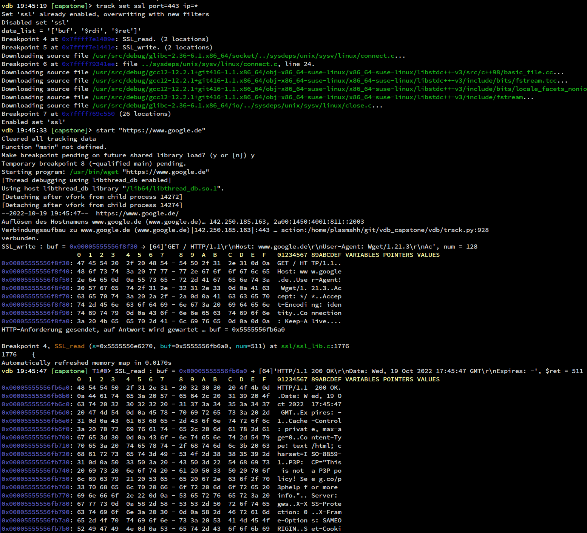

# track

The `track` command allows you to track the data of gdb expressions on hitting breakpoints. While this module is active,
whenever a breakpoint is hit an internal callback will be called, this may be a performance issue for some. All
breakpoints that have a trackpoint attached will automatically continue when hit, making data collection an automated
task.

## Single Tracks

The (classic) quick way to use track is by using single breakpoints and/or attaching tracks to existing breakpoints. For
more complex scenarios see the track set section later.

### `track show`

Shows the currently known breakpoints (similar to `info break`) along with the information about registered tracking
information.


### `track <num|location> <expression>`
This will  use gdbs existing breakpoint no `num` and will execute `expression` each time, recording the resulting string
along with a timestamp.

Instead of giving a number in `num` you can also provide an expression that will then be given to gdb to create a new
breakpoint. This breakpoint however will remain active even after the trackpoint has been deleted. Be careful though
that you may end up with multiple breakpoints for the same address which may incur a performance hit. We try to filter
out by the location string you passed, but what gdb gives us may not always be the same you passed, thus we can not
distinguish.

### `track/[<expression-specifier>]`

See track [expressions section](#track-expressions) later.

### `track data`
This shows a table with all the collected data. In (default) relative mode, all timestamps are relative to the first
recording. You can set `vdb-track-time-relative` to disable this and use local timestamps instead (useful for long
running programs where the breakpoint is only hit occasionally). Note that this will display the string from the
expression per table entry without any further formatting, as such it is most wise to use expressions only that have
small outputs.

Setting `vdb-track-clear-at-start` to off will disable the automated clearing of tracking data when (re)starting a
process.

If at a specific breakpoint an expression did not yield any output (or caused an exception) this field will remain
empty.


### `track del`
This deletes a track entry by the number shown in `track show`, just like `del` does for breakpoints. You can specify
multiple trackpoints.


### `track clear`
Clears the data cache displayed by `track data`.

## Track Sets

A track set is a bunch of more detailed track specifications that work together. There are a few predefined ones and
then you can add your own. For most detail have a look at the ssl_set definition in track.py
<details>
<summary>ssl_set</summary>

```
ssl_set = {
            "SSL_read" : # A function/location to set the breakpoint
                [   # a list of "actions" with their parameters, a non matching "filter" will stop evaluation
                    ( "filter", [ "map", "ssl_fd_filter", "s->rbio->num" ] ),
                    ( "hex", [
                            ( "buf", "$ret" ), # hex expects address and length
                            ( "$rdi", "$ret" ) # only if the above doesn't work, try to fall back to these
                            ]
                            ),
                ],
            "SSL_write" : [ ( "hex", [ ( "buf", "num" ), ( "$rdi", "$rsi" ) ] ) ],
            "connect" : [
                    ( "filter", [ "cmp", "{port}", "ntohs( ((uint16_t*)addr)[1] )/p" ] ),
                    ( "filter", [ "cmp", "{ip}", "( ((sockaddr_in*)addr)->sin_addr)" ] ),
                    ( "store", [ "fd", "ssl_fd_filter" ] )
                ],
            "close" : [
                    ( "delete", [ "fd", "ssl_fd_filter" ] )
                ]
            }
```

</details>


A Set is a dict of breakpoint locations associated with a list of actions that may or may not work together. These
actions can have as parameters expressions that need to be evaluated. To define how to evaluate them, you can append a
`/<epxression-specifieer` at the end. See track [expressions section](#track-expressions) for details.

Each breakpoint location key has a list of tuples that each contain an action item. The first of the tuple is the name,
the rest is depending on the action item type.

At certain points there is the possibility to use `{name}` to request parameters. These must be specify in the form of
`name=value` after the set enabling command.

Certain actions do support `$ret` as the value. This is a special value that means the return value of the function the
breakpoint currently is in should be used.

### Filters
Filters can abort the evaluation of the list of actions. The second parameter is a list of filter types. There are
multiple types of filters:
* `cmp, <value>, <expression>` Compare the given value. Instead of a value you usually want to use `{name}` to be able to specify that as a
  parameter when enabling the set.
* `map, <mapname>, <expression>` Compare if the value of the expression is in a set previously filled by store actions.

To allow for multiple alternative syntaxes to access certain values, whenever a value of an expression is not available,
the filter behaves as if the comparison yields true.

### Stores/Deletes
A store takes an expression and the name of a map. This name can be used in a map filter command. This is useful for
when at a certain point your program maps something to an id but at the interesting points only the id is available for
a filter. Multiple stores will store multiple values in a set.

The delete will delete the value from the set that is given by the mapname.
### Hexdump
This action will output the given data as a hexdump. Instead of just a pair/tuple of buffer/size, this will take a list
of tuples. The first one that yields a result will be used to hexdump. Supports `$ret` as an expression.

### Data
Takes a list of expressions (supports `$ret` too ) that will then be filled into the internal track data store and are
available via `track data`

### Predefined Sets
The following sets and their purpose are predefined

* `ssl` Hooks into `SSL_read` and `SSL_write` and can filter by port and IP, and will display buffers as hexdumps.

## Track expressions

Normally the expression is one that is evaluated by gdb to lead a gdb value of a variable by the given name.

There are various ways where you can append a single letter to a specification (Either `track/x` for single tracks, or
at the end of an expression in track sets).

The meaning of the letters is as follows:

* `v` Query the currently selected frame (in the breakpoint) for a variable with that name. This is usually the default.
* `x` Use `gdb.execute()` on the expression and use the result (ususally a string).
* `X` Use `gdb.execute()` on the expression, but then use `gdb.parse_and_eval("$")` to get the gdb.Value of that result.
* `E` Use pythons `eval()` to run the expression as python code. For convenience `$()` is synonymous with `gdb.parse_and_eval()`.
* `p` Call `gdb.parse_and_eval()` and use the result (usually  gdb.Value).

Depending on the context where these values are being used, they can be subject to conversion to other types.

## Other flags / special functionality.

### Interval support
Using the `/i <interval>[,<count>]` flag you can enable an interval mode (instead of breakpoint mode). In this mode the
program will be interrupted every `<interval>` seconds and the expression is executed as usual. This means you would
most likely want to use global variables for this. An optional `<count>` parameter can be added, stopping data
acquisition after that many counts.


Using `vdb-track-interval-sleep` you can specify a default value to sleep before recalculating if the program should be
interrupted. Using 0 here causes the module to calculate a time on its own, depending on the interval.

With `vdb-track-interval-sync-to-second` you can tell that the first interval should start approximately at a whole
second, this way you might be better able to synchronized with existing program timings.

You can use `vdb-track-skip-long-intervals` to skip an interrupt, if during data gathering and processing the next
should have been there. Normally it would be executed right after the previous one in that case, but sometimes being
synced is more important than getting data on every step.

Currently the breaking and data acquisition takes at least approximately 10-15ms, depending on the amount of data being
read and the speed of the interface being used. You should not chose a significantly smaller interval, otherwise this
interferes too much with your programs timing.

### Array support
At various places you can notify the track module that the data is an array instead of a single variable by using the
syntax `[@###]` ( where `###` is the number of array elements ). This can be combined efficiently with the struct mode
to directly get multiple values at once.

### python structure support
Using `/s` we can instead of an expression to execute use a special enhanced version of python structure specifiers. It
is a comma seperated list of `<name>:<spec>` where `<spec>` is a specifier of the python struct module. The name is
optional, if left out, the data will not be acquired by the track module.

### Data unification
Using `/u` we can gather data in a special mode for arrays. For that one of the fields needs to be named `ID`. In this
mode the whole array is being read, but only entries for which an `ID`  has not yet been seen will be used. The result
will be an array instead of a single value per track data entry. Modules that work on the data need explicit support for
them.

### Examples
TODO: all combinations of useful flags

```
track/sui 1,5000 0xfb44530[@256] ID:H,:6x,VALUE:Q
```
Tracks every 1 second ( for 5000 seconds ), taking the address 0xfb44530 and interpreting it as an array of 256 elements
of an 16bit integer (named ID), followed by 6 bytes padding data, followed by an 64bit integer ( named VALUE ). The
values will be unified by `ID`. In this case this also means that after 64k you will get no more updates. This is
probably the most efficient way to produce data for the histogram module.
