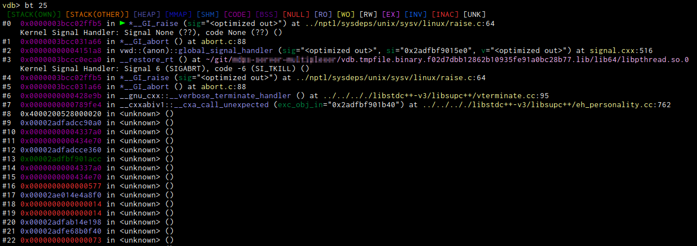
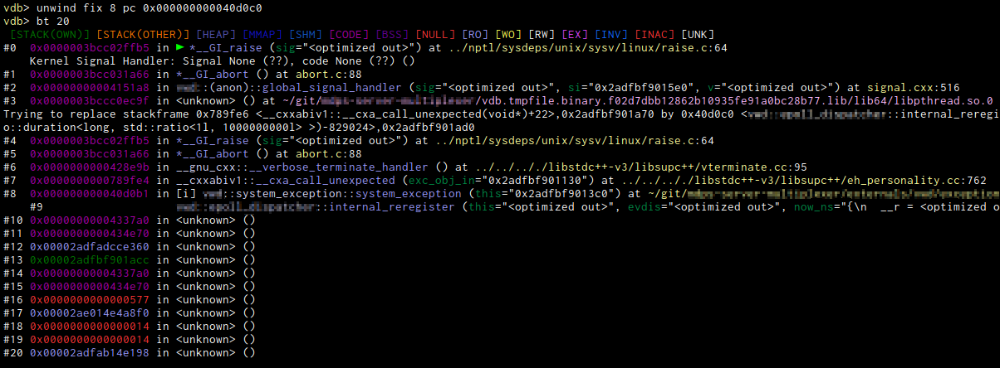

# Unwinder

An unwinder tries to take over the work from gdb of unwinding the stack, which can be quite a messy thing and sometimes
go wrong

## theory of operation

In a first pass we let the gdb unwinder do its thing and just cache the results (cache gets invalidated when the program
stops again etc.). Then when unwinding is done next, we can jump in. For that we have to invalidate the register cache
of gdb so it calls us again, which has some nasty side effects too, which we try to remedy.

During that we can chose to return the values extracted from gdb, or we can replace some values for some registers in
certain stack frames. This may lead to leaving out stack frames, causing gdb to find one it didn't find before, or to
recover parameters and registers in a different way.

### limitations
Since we often need the frame before or after it, a lot of things cannot be done for the last or first frame.

Since we don't want to do all the debug information handling, we leave it to gdb to do most of the heavy lifting, which
means that often we need to cache all the unwinding and then only in a second pass can do our stuff. For this we
sometimes invalidate the register cache which can have ugly side effects. 

Also we are often wrong about registers, so you need to be careful about it.

Best is to leave it disabled and only use it for difficult scenarios where you know what you are doing.

## commands

### `enable` / `disable`
Enables or disables on the fly. Will cause certain caches to be flushed.
### `hide`
This tries to completely hide from gdb the existence of a frame by pretending the next after it can 
### `fix <frameno> <register> <value>`
Causes the register in the specified frame to be returned differently. All other functionality is basically implemented
using this primitive.
## configuration
```
vdb-unwind-enable
```
The default state of the unwinder. It is recommended to leave it disabled until needed.

## Example
Here you can see how after frame 7 gdb gets utterly confused and spits out nonsense.

After manually telling it that frame 8 is really a different position, gdb is able to get further (until again it loses
track. We could go on there for a next round if we so wanted)

# Stack search help
## `unwind hint` command
This command will help you search the stack for return pointers that originated from a function call to the current
frame. It will mark the most likely call, but otherwise output all valid code fragments that things on the stack point
to.

You can change its behaviour by the following configurations

```
vdb-unwind-hint-marker
```

Is the text that gets displayed when the hint heuristics think this is a very likely match.

```
vdb-unwind-colors-hint
```

This is the color the marker gets colored in.

```
vdb-unwind-hint-context
```
This is the context string given to the `dis/` command for disassembling the context around the possible match.

```
vdb-unwind-colors-hint-start
```

This is how the highlighting of a new hint match start message is done.
