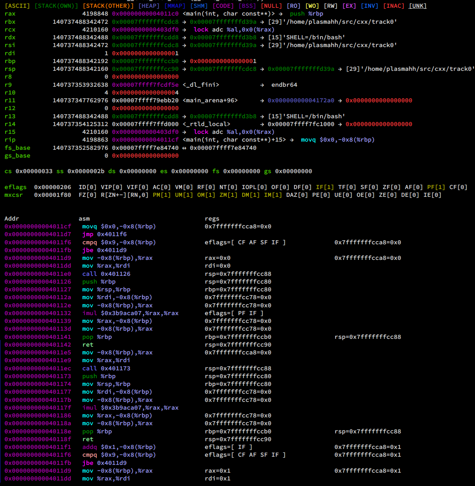
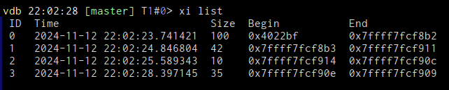

# xi
`xi`  works like `si` but with a lot more information. This of course also makes it slower, a tradeoff you have to keep
in mind.

You can do `xi` for a single or `xi <num>` for executing one or `num` instructions. They will be executed using gdbs
`si` command and then for every step, we record the general purpose register values and at the end print out all
registers nicely before the execution of each instruction (with its address) and the list of changed registers (and
maybe also flags). For many cases we can figure out that some memory has changed and print that out too

## Flags

* `xi/f` will use "full" mode, trying to read all memory mapped registers currently active (loaded via svd). This
    usually is a very lengthy process. Any non-numeric parameter will then be interpreted as a filter expression for
    these registers, e.g. `xi/f CNT 100` will step 100 instructions and record all peripheral registers that match
    `CNT`.
* `xi/e` This will cause a synthesized `step`  event to be emitted for every step. Depending on what is listening to
    this event it can be expensive which is why this is not active by default.
* `xi/F` Enables flow simulation for the instruction, allowing to detect a subset of memory changes (see screenshot).

All of the flags can be combined.

## Assembler output
`xi` uses the assembler output from the asm module, which itself uses the `xi` information from the previous xi run (if
any). This can cause the assembler instructions to be prefixed with the index of the instruction in that run.

## Subcommands

`xi` saves each list of executions internally, you can access those lists with the following commands:

### `xi list`
Outputs a table of previous xi runs with their timestamp, number of executed instructions and first and last recorded
instruction.

### `xi show <ID>`
Using the ID from the list output, this shows the output of that run again as if it just happened.

## Limitations
Only for instructions where this is explicitly coded the change of memory will be recorded, and there we do not have a
look at the number of bytes changed.

Also floating point/vector registers are not taken into account usually.

Lastly all memory changes not done by the thread currently being followed will not be detected and/or shown.
